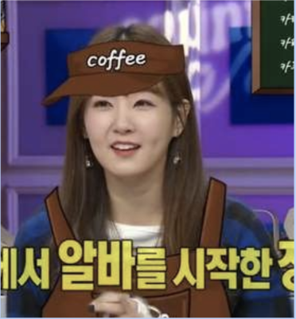
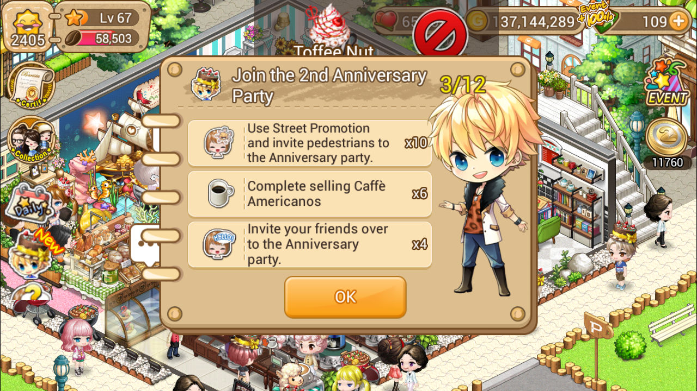
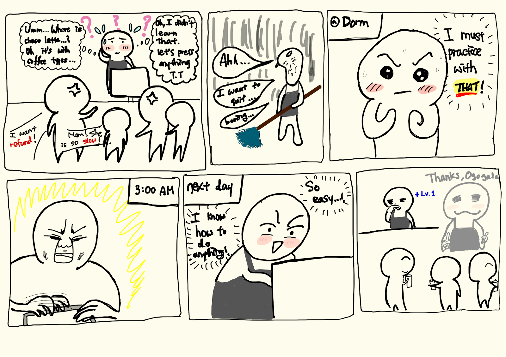
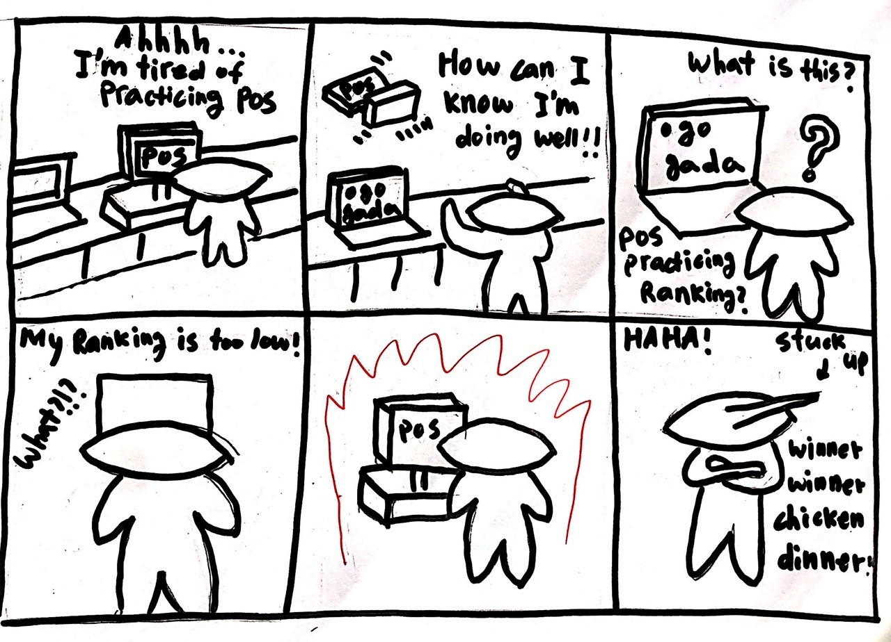
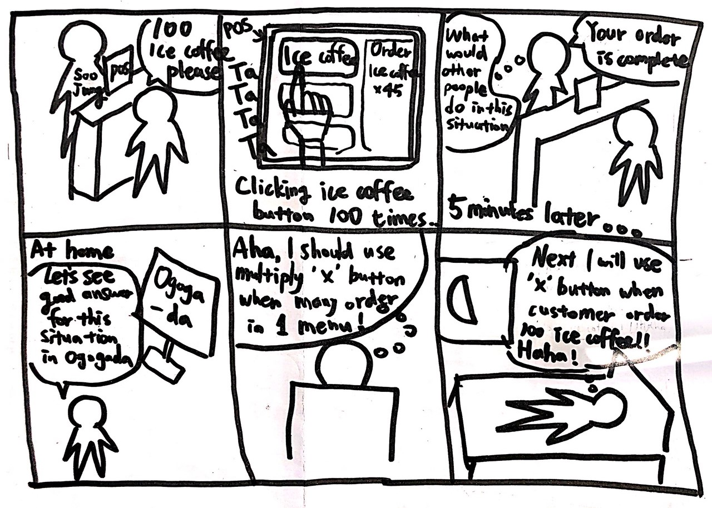

# [DP2] Ideation Report

## Team Ogogada
Sangmin Lee, Yoonseo Kim, Sungha Eom, and Sihyun Yu

### Experience
We want to redesign experiences of training for new cafe part-time job workers.

### POV : Point of View

Based on needs and insights from DP1 and in-class-activity, we have decided our one most compelling POV

> **A new cafe part-time job worker** needs to 
**practice a lot and quickly get familiar with POS** because **most new workers are at the complex device POS, but there’s no explicit instructions or guides for that and she doesn’t want to be embarrassed at sudden situations.**

### Persona

To help with prototyping and specifc implementation, we have picked one persona. 

>

* NAME: Soojeong Lee
* AGE: 22
* GENDER: Female
* POSITION: Gwangju
* EXPERIENCE: 2 weeks

* STORY

> Soojung Lee is a university student who moved a house a few months ago. During the summer break, she tries to save the money for the trip with her friends. Therefore, she decides to earn money by doing cafe part-time job. Since she moved her house a few months ago, a cafe that she works is very new for her and of course there’s no friends at the cafe. Plus, it was the first time for her working at the cafe. She makes a lot of mistake at POS while working, and this makes her so stressful. 

* MOTIVATION

> She needs money for travel, wants to make a new friend at the new place, and she thought cafe part-time job looks so fun.

* BELIEF

> Practice makes perfect. 
> I must be perfect at any situation.

* PREFERENCE
> fun and easy things

* GOAL
> Be perfect for working and not to be embarrassed at sudden, new situation at the cafe.

* Similar Experience
> I love cafe (Cafe Simulation Game)
> 

* Favorite
> Playing game  / Staying at home
> 
> Eating sweets / Sleeping a lot
> 
> buying a new cloth     

* Dislike
>Action Movie, Washing Dishes  
   

### HMW : How might we...
Based on POV, persona, and the method card at the course website, we wrote down 10 HMW questions for our problem redesign. We also denoted how these questions are driven. 

* HMW make learning POS like a game? (Create an analogy from need or context)
* HMW make all pre-worked workers and managers be able to educate new part-time workers with POS? (ID unexpected resources)
* HMW make convenient POS? (Remove the bad)
* HMW make working at POS the most easiest thing at the cafe (Explore the opposite, Play POV against the challenge)?
* HMW make part-time job workers can practice POS anywhere without customer?  (Question an assumption)?
* HMW make the POS the thing that part-time job workers want to do? (Play POV against the challenge)
* HMW make explicit instructions or guides not implicit? (Go after adjectives)
* HMW mollify customers and calm down part-time workers’ anxiety when many orders are at once (Break POV into pieces)
* HMW make convenient POS? (Remove the bad)
* HMW make the learning process of POS the most exciting part of the learning tasks? (Explore the Opposite)
* HMW new workers do other tasks instead of working at POS? (Change a status QUO)

After this, we picked top 3 HMW questions with a few criteria. Here are our criteria for choosing top 3 questions.

* Fits to the persona we set?
* Encourages users easy, fast learning?
* Makes the user not stressful?

Using these, we selected these 3 questions. We denote how these questions fit well with our criteria. 

* HMW make learning working at POS like a game? (Create an analogy from need or context)

> 1. Game is definitely not stressful.
> 2. It helps more focusing on learning, can leads to fast, efficient training for new workers. 

* HMW make all pre-worked workers and managers be able to educate new part-time workers with POS (ID unexpected resources)

> 1. There was no official way for them to teach POS to new workers. (From insight we found)
> 2. Many new workers also have no one to learn POS.
> 3. Direct help will help workers for efficient learning. 

* HMW make convenient POS? (Remove the bad)

> 1. Convenient, less complicated POS structure definitely make user less stressful. 
> 2. Easy to follow to learn the POS

### Solution Ideas
We tried to make approximately 10 solution ideas for each chosed HWM questions. And we came out with total 32 solutions. 
* HMW make learning POS like a game? (Create an analogy from need or context)
> 1. Time limit for the step and record for finishing the learning process
> 2.  Give score and answer after one round
> 3.  Various difficulty level based game
> 4.  Simulate complicated situations that frequently occur at the cafe
> 5.  Mangers give a deadline to finish a specific round of game
> 6.  Quiz related to the information for working
> 7.  Show rankings for workers or for specific round of a game
> 8.  Show game achievement rate
> 9.  Give mission to game users(workers)
> 10. Narrative story based game
* HMW make all pre-worked workers and managers be able to educate new part-time workers with POS (ID unexpected resources)
> 1. Make a list of common mistakes and upload it
> 2. Indicate what should be done in order
> 3. Share tips like community
> 4. POS histories which show nice answer of some situations
> 5. Statistics like which menu is popular in such time
> 6. Questions and anwers like perusall
> 7. Video lecture for workers
> 8. Cafe encyclopedia making together like wiki
> 9. Message function
> 10. In embarrassed situation, could ask the manager and experienced workers for help and get answers
> 11. notice function
* HMW make convenient POS? (Remove the bad)
> 1. Remove unfrequently used buttons(functions)
> 2. Use image instead of name
> 3. Colorful POS
> 4. Like trackpad with motion recognition
> 5. Voice recognition instead of touching POS
> 6. Searchable POS
> 7. POS shows instruction when ordering
> 8. Undo instructions in POS
> 9. Add/delete freely
> 10. Bookmark for frequently ordered menus
> 11. Show by red mark what is predicted in the next step or recommendation
> 
### Storyboards

* Storyboard 1
> 

Storyboard 1 is about first solution
"soooooolution 1"

* Storyboard 2
> 

Storyboard 2 is about second solution
"soooolution 2"

* Storyboard 3
> 

Storyboard 3 is about third solution
"sooooooolution 3"

### Studio Reflections

- There are many good comments about our presentation. First of all, many people noted that they liked the details of our persona. Those specific details made the persona more realistic.

> We thought of our persona through various interviews and based on that we found out some common characteristics among the interviewees. Then we picked some details that strongly relates to our POV.

- In contrast, there were also some comments about specifying the solutions. And one peer actually made a suggestion for one of our 3 solutions, which is 'visualizing past history'. 

> When we were thinking of the second solution, which is 'showing POS history for some situations', we talked about that as well, which just came out of our mind. For real implementation and testing for further process, we also think it is a great idea and as far as nothing changes we look forward to trying implementing it.

- The third solution, which is 'Showing ranks of specific rounds' was questioned by one of our peers. He is worring about whether it actually can motivate new part-time workers to practice. He also mentioned Korea education system, which emphasizes rankings but deters the motives for studying.

> Our intention was to encourage new part-time workers. Because even if they don't play well at first, they don't lose anything or get punished. But they would feel great when they finally play well. But we realized that the point given is still a crucial point that we have to care about until implementing the solution.

- For minor comment, some liked the storyboards and how we approached the HMW questions.

> We kept up the criteria given in course website, and that helped us a lot.
