# [DP3] Paper Prototyping Report

## Team Ogogada
Sangmin Lee, Yoonseo Kim, Sungha Eom, and Sihyun Yu

### Experience
We want to redesign experiences of training for new cafe part-time job workers.

### Photos of Paper Prototype
* Paper prototype with keyskin as keyboard and users' finger as mouse
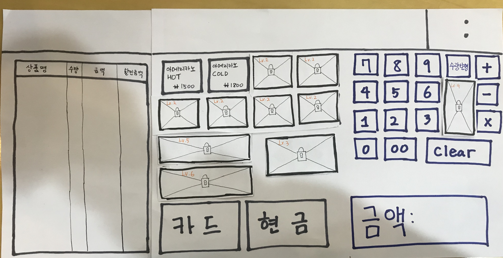
* Additional paper for menu button switching
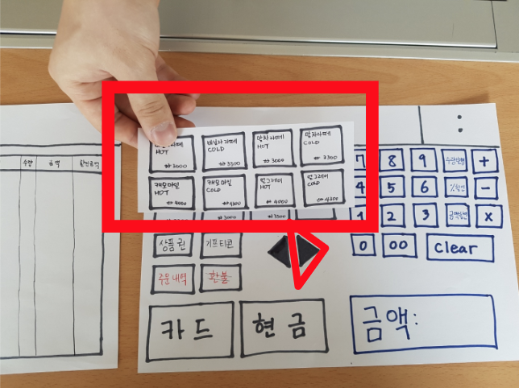
* Transparent paper for changing, showing the price 
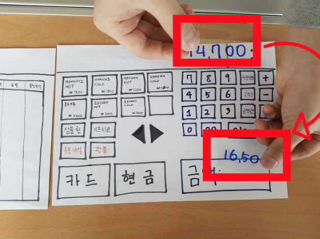
* Narrow paper for denoting menu list
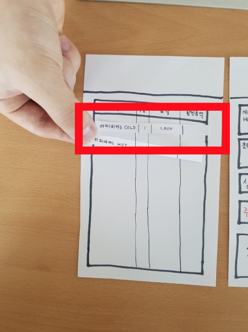
* Hand shaped icon for following 'history'
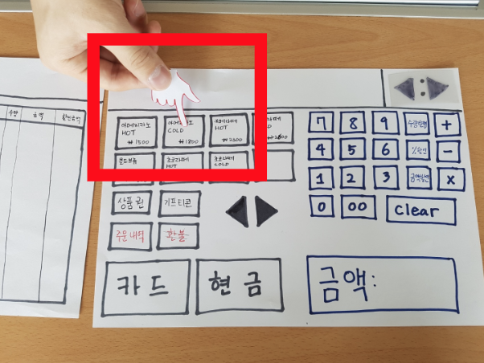
* Transparent paper for previous/next step button for 'history'
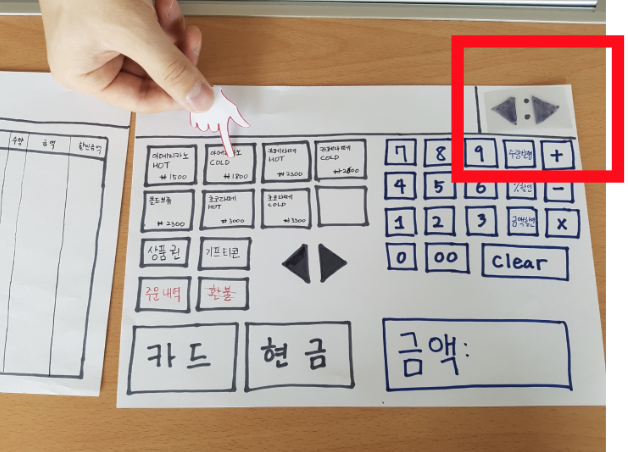
* Additional paper for popup window
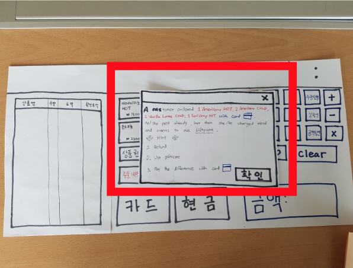

### Participants 
- Total 5 participants for testing paper prototyping test
- 2 people (completely new at using POS), 1 person (had experience using POS but forgot it), 1 person (have been using POS less than 1 month), 1 person (has a lot of experiences using POS)
- Before tests, we did short interview with following questions.
  - Do you have experience using POS?
  - If yes, why did you use the POS? (get a part-time job?)
  - If no, do you any plan to use the POS and why? (plan to get a part-time job?)
1. Apple Pie (totally new at using POS, 19 years old, male)
   - Totally new at using POS
   - Planning to get a part-time job at summer break
   - Wants to experience new social life through a part-time job    
2. Banana Latte (worked at cafe less than 1 motn, 19 years old, female)
   - Have worked less than 1 month 
   - Needs money for living expenses
   - Still working in cafe and has a lot of confusing points at using POS
3. Citron Cake (totally new at using POS, 22 years old, male)
   - Totally new at using POS
   - Has never done cafe part-time job
   - Has a plan to get a part-time job before his graduation
4. Decaffeine Coffee (had experience using POS but forgot about it, 23 years old, female)
   - Had an experience using POS, but she forgot about it
   - Had worked in book cafe (책다방) as KAIST Student Culture & Space Committee (공간위)
   - Only know basic tasks related to POS
5. Espresso Shot (has a lot of experiences using POS, 23 years old, female)
   - Has a lot of experiences using POS
   - Needs money for living expenses
   - Has experienced various tasks related to POS such as using Gifticons and refungins

### Briefing
Dear user, thank you for being a test user of our team Ogogada. This is our paper prototype. The goal of the project is to redesign experience of training for new cafe part-time job workers. Think of this paper prototype as a tablet monitor, and the person in front will be a computer and execute the function of it. In addition, the keyboard is replaced by a keyskin, and you can touch the screen with your finger. You should read the 3 given tasks and solve them within the prototype. The computer may be slow.
### Tasks
 - Practice POS game with given simple order
   - We gave users simple orders to get them adapt to ordering. There is timer limit so that they would feel like playing game.
 - Practice POS game with given complex order
    - If the user got fully leveled up, then the user can play with certain *modes*, such as 'time-attack mode' or 'blank mode'. There's a stack of orders the user should accomplish in short time, or some orders are invisible for short period of time that demand quick glance and remembering, to train in practical busy situations. Below pictures are of *time-attack mode*
 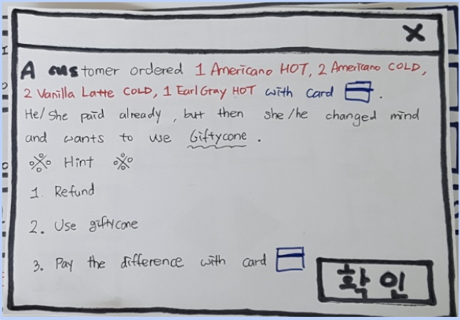
 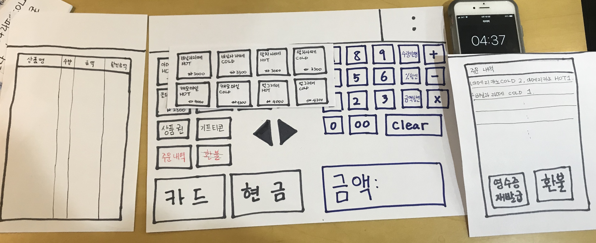
 - Learn POS by watching history of given situation
    - If users want to find out what other experienced workers do in certain situation, they can look up the history section. Then they follow where hand-shaped icon points. If they want to go back or forward quickly, they can use previous/next step button on right top side.

> -  Try our game until leveling up to the highest level
>     - Through DP3 studio reflection, we felt the first task is not a distinct task from the second task. So we decided to emphasize the novelty of our POS practice program which is 'playing like game'.
    Users start from ground level which is taking order for only Americano's, which is very easy. The locked up images will stimulate curiosity of users and make them engaged into playing more until leveling up.
     As they level up, some locks are released and the difficulty increases slowly. If they become fully experienced with the first task, they are to play the second task.
 > 
The user is currently in Lv.1
 > 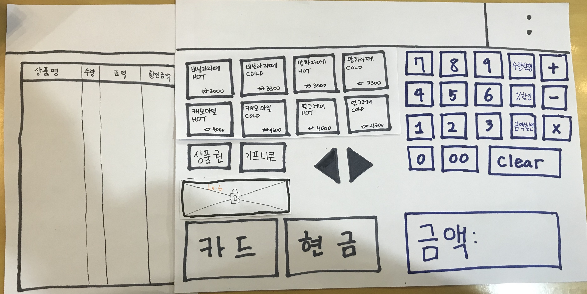
The user played our game and is leveled up to Lv.5

### Observations

- Task 1
    - Colors of menu buttons at UI are all same that hard to distinguish and remember the position of menus for new workers (P2, P5)
    - Hard to find some buttons such as switching menu button on the POS for no experienced users (P2, P3)
    - Do not care about showing time limit about the task on UI (P1, P2, P3, P4, P5)

- Task 2
    - Users cannot use hint since they immediately close it and no way to recheck the hint at after closing the popup (P3, P5)
    - Instruction popup page at task 2 are so long that they are not readable, so hard to realize what they have to do (P1, P3, P5)
    - Pressing all buttons if he/she doesn’t know what to do next are inconvenient (P2, P3, P4, P5)
    - Confused with the number button at keyboard and number button at POS display (P3)

- Task 3
    - It is hard to realize the purpose of hand cursor is to suggest users to follow the instruction. (P1, P3)
    - Immediately forget what he/she need to do at that situation after seeing the history at current UI system (P1, P2)
    - Hard to find “Show the next step” button while checking the history (P2, P3)

We reclassify observations into 3 themes

- Affordance
    - Task 2 - Users cannot use hint since they immediately close it and no way to recheck the hint after closing the popup (P3, P5): High
        - Need to add re-popup the menu button on UI
    - Task 3 - It is hard to realize that the purpose of hand cursor is to suggest users to follow the instruction. (P1, P3): Medium
        - Can add ‘click me’ text on the finger icon
    - Task 2 - Users get confused with the number button at keyboard and number button at POS display (P3): Low
        - We can give hint to use which buttons should be used on UI for very first learning POS
    - Task 1,2 - Users don’t care about showing time limit about the task on UI (P1, P2, P3, P4, P5): Low
        - Users already enough focus on the task
        - With ranking system among people, we expect they care about the time

- Visibility
    - Task 2 - Instruction popup page is so long that they are not readable, so it is hard to realize what they have to do (P1, P3, P5): High
        - Need to use a lot of images to visualize the task
    - Task 1 - It is hard to find some buttons for switching menus on the POS for no experienced users (P2, P3): Medium
        - Can add some one line text description at important buttons
    - Task 1 - Colors of menu buttons at UI are all same, so it’s hard to distinguish and remember the position of menus for new workers  (P2, P5): Medium
        - We cannot change the position of menu (since the purpose is educational), but we can differentiate the color for users to remember the position easily at our UI
    - Task 3 - It is hard to find “Show the next step” button while checking the history (P2, P3): Medium
        - We will add ‘Click me’ text near to the button at the first time the button appeared

- Efficiency
    - Task 2 - Pressing all buttons if he/she doesn’t know what to do next is inconvenient (P2, P3, P4, P5): High
        - After a few second, add guide that which button should be clicked
    - Task 3 - Users immediately forget what he/she needs to do right after seeing the history at current UI system (P1, P2): Medium
        - Gives opportunity to repeat the process after seeing the history

### Individual Reflections

- Sangmin Lee
 
> I played computer when we testing our prototype. I tired to act quickly and correctly, when there are some actions from user.
&nbsp;
With the role of computer, I feel confused at the first. I never use POS machine before, so I didn't know how to react at some action of user. I spends some time to practice.
&nbsp;
I also have some difficulties during testing. First is reacting time. Because there is so many small paper pieces in front of me, I usually confused which is correct to the situation. Sometimes, it take lot of time to find out the appropriate one. So we made and showing "loading" paper during I found the pieces.
&nbsp;
Next is related to the users action. At task 2, we only make '2 Vanilla Latte Hot' pieces, but some users touch Vanilla Latte Hot only one time at the first. We didn't think about this situation, so I have some problem at react. To solve this problem, we made X paper to show the action is wrong.
&nbsp;
DP3 was very difficult project to me. I thought that paper prototype has lot of limitation, so it is impossible to make conflict function with paper prototype. However, after presenting project, I notice that this is wrong. For the next project, I will try to be open mind at our project.

- Yoonseo Kim

> BBB

- Sungha Eom

> CCC

- Sihyun Yu

- Sihyun Yu

> I participated as observer with 5 participants for all 3 tasks. I took some pictures to capture the features of users' behaivior and tried to focus on aspects that users feel difficulty. Below are some comments while I observing others' testing, and picture I took. (To write comments faster, I wrote down it in Korean while testing)
> 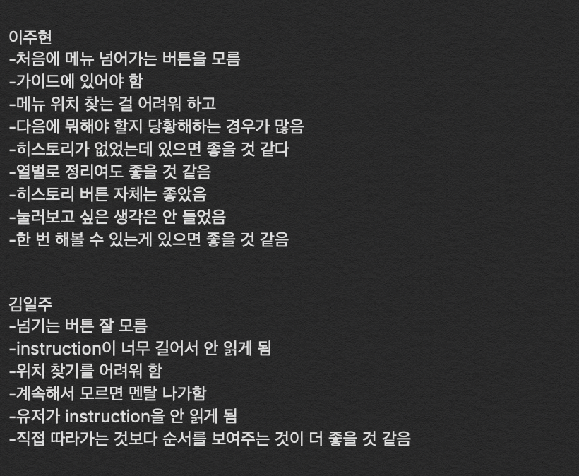
> 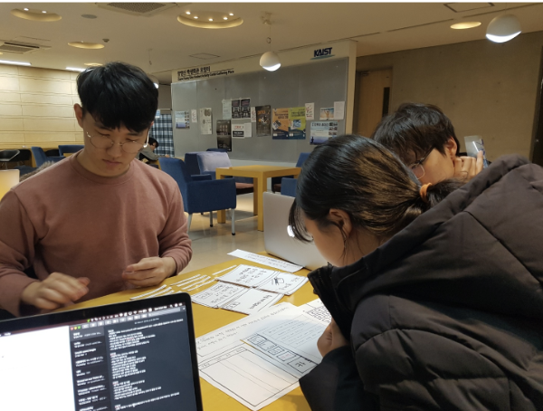
> 
> For each participant, I found 6, 9, 6, 4, 5 observations. Then I summarized all of observations, with different participants), shared and discussed with our teammates. 
> 
> There are a few difficulties that I could not expect. First of all, users often do many actions within very short time that hard to capture some important features. I needed to observe, write down some features at the same time but there's not enough time due to the user's so fast actions while testing. 
> 
> Furthermore, it was quite only 'observe' the user without saying anything. I knew saying something to tester would interrupt them for correct and meaningful testing, but saying nothing even if user has some problem with our UI was really hard thing. 
> 
> Even if I took Intro to Social Computing class and tested and observed my lo-fi prototype at previous semester, this was completely new and challenging problem due to the differnec between the test using UI on computer and using very basic prototype using paper. For next testing for our modified paper prototype and further milestone, I'll consider more about this. Maybe we can take a video, and think more carefully say something while testing.

### Studio Reflections

There a lot of comments after the presentation. Because this milestone affects to all of further milestones for prototypes, we concerned more about feedbacks from others compared to before. 

First, there were some feedbacks about the device we should choose for further prototypes and user test. Someone asked, "What if the UI use touch sensor to operate on portable devices like Ipad or phone?" and another person mentioned that there will not be no additional keyboard for users if we select portable devices for making prototype.

> 	We agree with this and selecting portable devices such as iPad are really great idea. Also it is true that for users' perspective, it is hard to have additional keyboard for test, we need to consider a lot for further prototypes.

Also, there are some comments about lack of novelity with our prototype. Someone note that our UI is almost same as the original POS UI, so there's no novelity on our paper prototype. The only new thing is we can see history via our paper prototype. Also, there was a comment that it will be better to add new menus at UI for practice purpose.

> We strongly agree with this. We only thought about "Is it possible to this with paper?". We think this wrong understanding at paper prototyping milestone lead this result. Therefore, based on feedback, we redesigned our paper prototype (added picture at the end of prototype section) and changed the first task (added the new task at the end of task section). Before making lo-fi prototype, we are planning to test our modifed prototype to users and will apply those observations to our lo-fi prototype. 

Someone note that the fact that we added computer loading sign while testing was nice.

> We concerned a lot how our paper prototype looks similar to real computer prototype and this was one of the results. For further milestones, we will consider a lot about many aspects, not only this perspective. 

For the minor comment, there was a comment that instead of skipping slides, just remove it and give information about them.

> We also think this is a good idea. It was hard to present so many slides within 7 minutes. Rather than show many slides for a short time, it might be better to show less slides for a long time and each slide present our main key point efficiently. 
