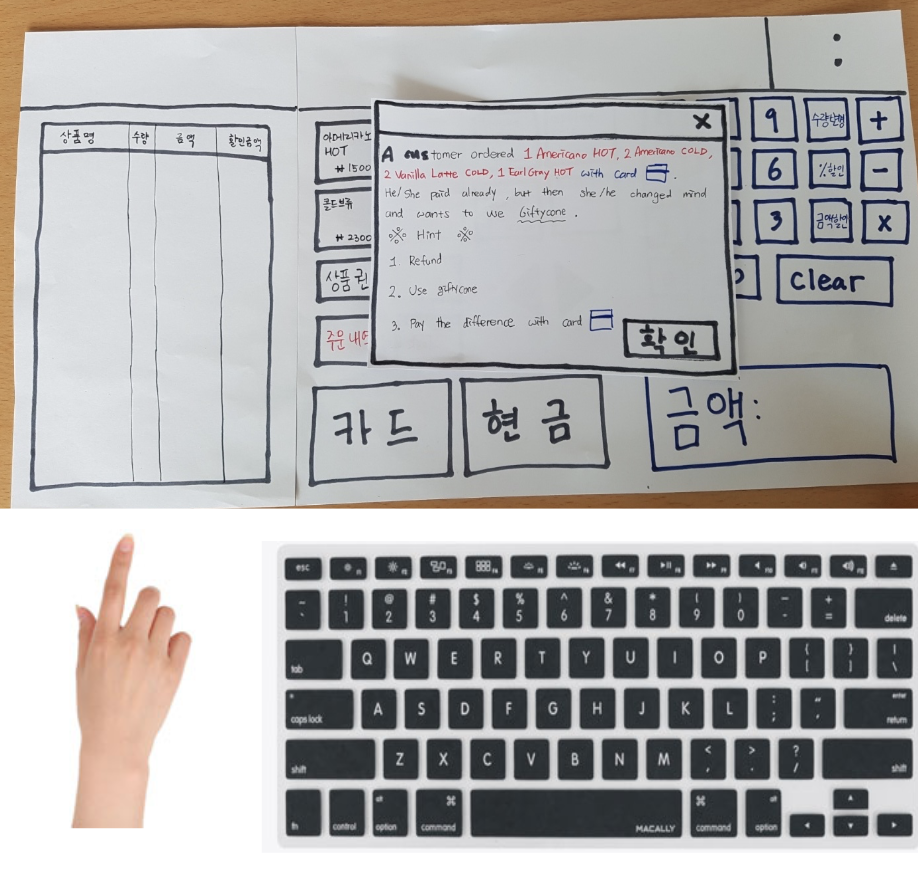

# [DP3] Paper Prototyping Report

## Team Ogogada
Sangmin Lee, Yoonseo Kim, Sungha Eom, and Sihyun Yu

### Experience
We want to redesign experiences of training for new cafe part-time job workers.

### Photos of Paper Prototype
* Paper prototype

* Used the additional paper for menu button switching

* Used the transparent paper for changing, showing the price 

* Used narrow paper for denoting menu list

* TODO

* TODO

* TODO

### Participants 
- Total 5 participants for testing paper prototyping test
- 2 people (completely new at using POS), 1 person (had experience using POS but forgot it), 1 person (have been using POS less than 1 month), 1 person (has a lot of experiences using POS)
- Before tests, we did short interview with following questions.
  - Do you have experience using POS?
  - If yes, why did you use the POS? (get a part-time job?)
  - If no, do you any plan to use the POS and why? (plan to get a part-time job?)
1. Apple Pie (totally new at using POS, 19 years old, male)
   - Totally new at using POS
   - Planning to get a part-time job at summer break
   - Wants to experience new social life through a part-time job    
2. Banana Latte (worked at cafe less than 1 motn, 19 years old, female)
   - Have worked less than 1 month 
   - Needs money for living expenses
   - Still working in cafe and has a lot of confusing points at using POS
3. Citron Cake (totally new at using POS, 22 years old, male)
   - Totally new at using POS
   - Has never done cafe part-time job
   - Has a plan to get a part-time job before his graduation
4. Decaffeine Coffee (had experience using POS but forgot about it, 23 years old, female)
   - Had an experience using POS, but she forgot about it
   - Had worked in book cafe (책다방) as KAIST Student Culture & Space Committee (공간위)
   - Only know basic tasks related to POS
5. Espresso Shot (has a lot of experiences using POS, 23 years old, female)
   - Has a lot of experiences using POS
   - Needs money for living expenses
   - Has experienced various tasks related to POS such as using Gifticons and refungins
### Briefing

### Tasks

### Observations

### Individual Reflections
- Sangmin Lee
> AAA
- Yoonseo Kim
> BBB
- Sungha Eom
> CCC
- Sihyun Yu
> DDD
### Studio Reflections

- AAA

> BBB
