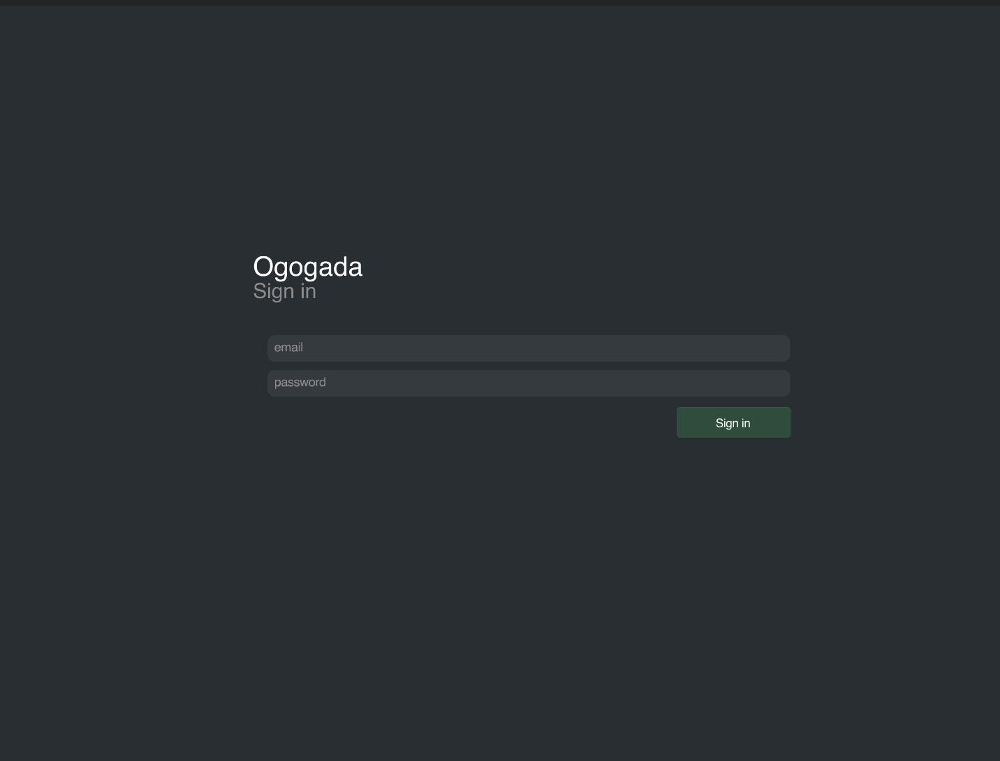
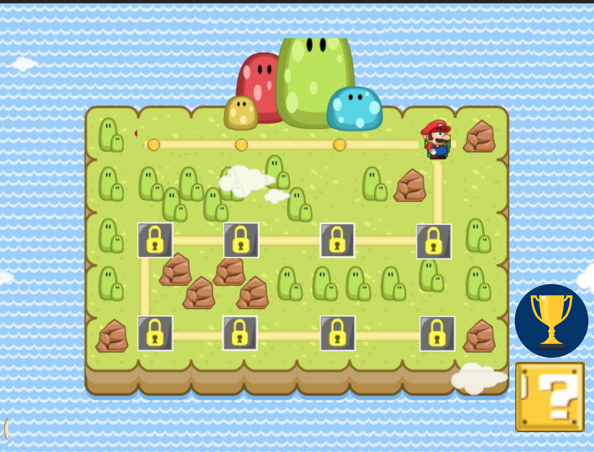
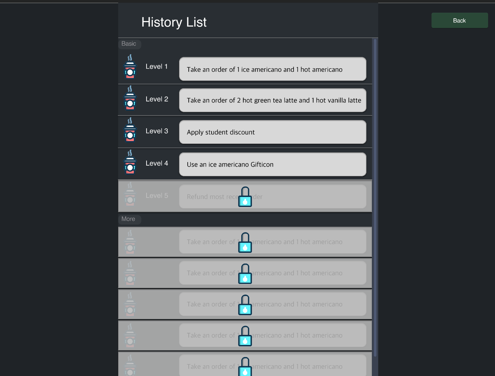
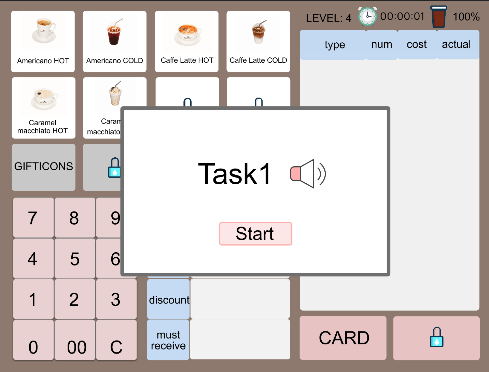

# [DP4] Lo-fi Prototyping

## Team Ogogada
Sangmin Lee, Yoonseo Kim, Sungha Eom, and Sihyun Yu

**We modified the task 3 and did user testing with modified prototype and tasks.**

### Experience
We want to redesign experiences of training for new cafe part-time job workers.

### POV
A new cafe part-time job worker 
needs to <strong> practice a lot and quickly get familiar with POS </strong> because <strong> most new workers are at the complex device POS, but there’s no explicit instructions or guides for that and he/she doesn’t want to be embarrassed at sudden situations. </strong>

### Tasks
Since we want to let the user practice POS feeling like playing game, we asked for test users to follow the 3 tasks below.

1. Watch the guide (history) of how to use POS (using Gifticon at the situation).
2. Do the task at level 4 and level up to 5.
3. See the ranking of doing task at level 4.

### Prototype
- Sign in 
  - The user needs to click 'Sign in' button to move to the home.

- Home
  - description

- (Task 1) Watch history at Lv.4
  - description

- (Task 2) Do the task at level 4 and level up to 5.

The user can listen the task by clicking sound icon which is located right of 'Task1'. We didn't implement the sound function in lo-fi prototype. And the user can start the task by clicking start button.

When the user clicks the wrong button, the coffee on the upper right corner grows and moves to center.

Since the user clicked the wrong button, the amount of coffee changed from 100% to 90% which indicates accuracy of the player.

When the user finishes the task, the level increases, and shows amount of time the user spent on this task, the best accuracy, and the ranking.

As the level rises, the available buttons increase, and the UI shows the newly opened button.

- (Task 3) See the ranking of doing task at level 4.
 

### Observations

### Paper vs Digital

We used Sketch and Invision as a digital prototyping tool.

We use this tools because they provided a familiar platform that we usually have used such as iOS UI or Android UI. Furthermore, the layer system was very similar to the one in Photoshop, so it was quite easy to get used of this platform. Also, the homepages offer detailed instructions. Lastly, we are so fascinated the program visualizes hotspots very well between screen to screen.

* Difference in usability issue
> Efficiency: With our lo-fi prototype, when participant doing wrong, then it shows what to do next. It helps reduce time to test prototype.
>
> Learnability: Our paper prototype has simple UI, so participant easily understand what they are doing. However, with lo-fi prototype, user have problem with new UI. They often confused with meaning of the level select page.
>
> Safety: With our lo-fi prototype, participants may repeat the same task without going to the next task.

* Difference in participants' reaction and expectation
> At DP3, our paper prototype UI is almost same as original POS and the tasks are about learning how to manipulate the force like receiving an order, checking history. It is simple and intuitive, so participants easily understand what they are doing. However, with lo-fi prototype, participants are confused at purpose of level select page because of poor explanation. Moreover, due to insufficient explanation and fast loading, participants proceeded with their tasks without knowing what they are doing.

* Changes from paper to digital
> We received some feedback for our paper prototyping. One of the most focused things we have is the novelty of the UI. Our paper prototype UI lacked of novelty. It is almost same as the original POS UI. We try to add more pages such as, level select page, history select page. We also added the ability to show the accuracy in a visible way, and adding a menu showing the accuracy and time-based ranking for each level. 

### Studio Reflection
There were many feedbacks after the studio. We summarzied these and some of these are reflected before the user test. 
 
> I like your team make your prototype as a game so that user can achieve their tasks step by step.

We were happy that the purpose of our prototype was well shown, and tried to more focus on gamification suah as ranking system in our further low fi prototype before user testing. 

> 15SQuad/Doheon: I wish the accuracy decrease animation would not disturb the user too much when doing the task.

The purpose of this is to emphasize users about accuracy decrease. However, we agree that this will disturb users to use the prototype comfortable. For mid fi and high fi prototype, we'll decrease the animation for this. 

> I wish the goal/task is shown with bigger font. It’s very hard to find what the user is expected to do. Popup in the beginning of the page would be another good alternative.

We also agree with this. The original purpose of our prototype was just listening the order one time to simulate real situation to users, but since this is for an educational purpose, this might be unnecessary. We will talk this more with our teammates and users. 

> I wish the accuracy of the completed levels are shown on the level screen. 

This is a really good idea. We can add this on further prototypes. 

> I wish there could be a way such as jump so that user who already know lower level may go to higher level immediately.

Also agree with this and we can implement this with further prototype. Visualizing the movement of character would be very important users to understand the system of our prototype. 

> How can we know the correct answer for each stage? It will be better with correct instructions which helps users doing his own.

We can check the basic order with given goal at the history list, and the purpose of the real game is to get familiar with more complicated situation compared to showing history. Therefroe, our decision is not to show the answer for the real stage since the purpose of the real stage is get used to POS without real answer. 
