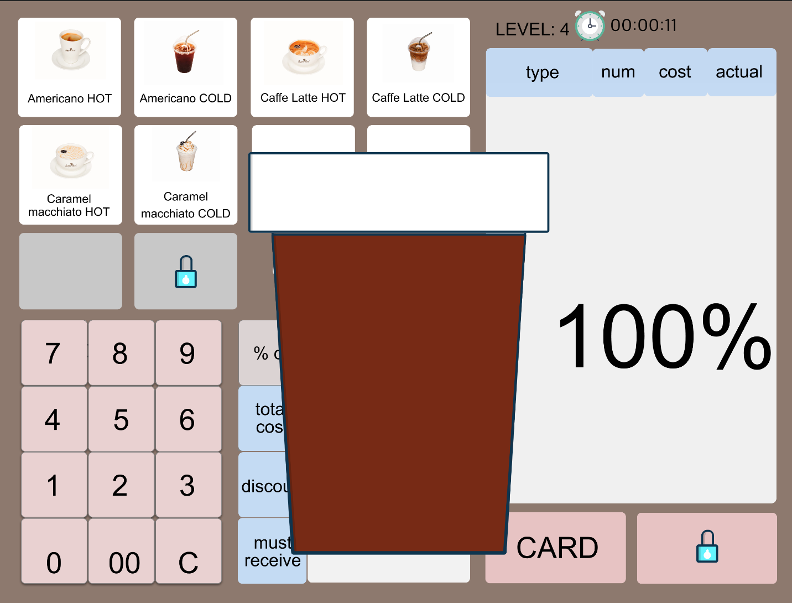
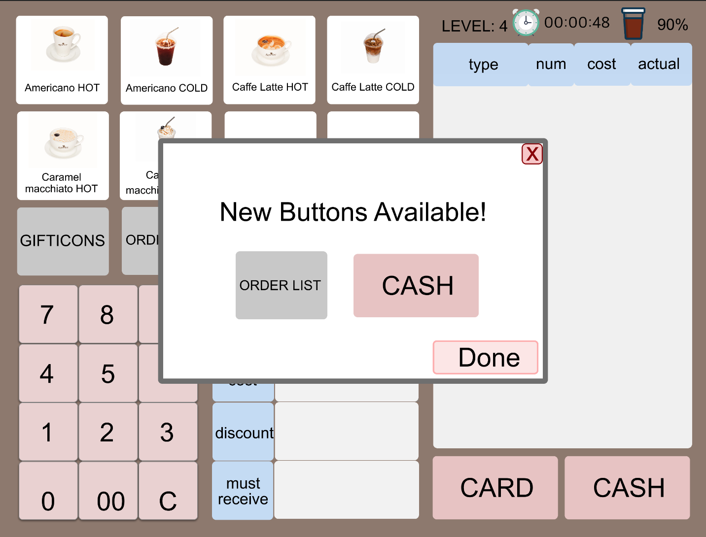

# [DP4] Lo-fi Prototyping

## Team Ogogada
Sangmin Lee, Yoonseo Kim, Sungha Eom, and Sihyun Yu

**We modified the task 3 after the studio and did user testing with modified prototype and tasks.**

### Experience
We want to redesign experiences of training for new cafe part-time job workers.

### POV
A new cafe part-time job worker 
needs to <strong> practice a lot and quickly get familiar with POS </strong> because <strong> most new workers are at the complex device POS, but there’s no explicit instructions or guides for that and he/she doesn’t want to be embarrassed at sudden situations. </strong>

### Tasks
Since we want to let the user practice POS feeling like playing game, we asked for test users to follow the 3 tasks below.

1. Watch the guide (at History List) of how to use POS (using Gifticon at the situation).
   
   - At the first time, users don't know how to do something with POS at certain situation, such as using Gifticon, cancel the purchase, and so on. Therefore, we provide the instruction with very basic situations that most workers frequently met while working at the cafe. We divided these situations into levels and show these instructions as the user level up at our UI. The first task of our prototype is to check this guide of using Gificon assuming very simple situation. Users will experience and follow how to use Gifticon at very simple situation with the instruction that we provided by red rectangles.

2. Do the task at level 4 and level up to 5.
   
   - Even if, new part-time job workers watch the guide of using POS, it does not mean they can use the POS correctly in such situation. Moreover, it is quite different in real work. There might be various and complex situations in real world. Therefore, they need practice to be familiar with such functions of POS. By the second task, the user can practice POS with complicated situations, and be familiar with POS and real world without any guide or instructions by red rectangle.
  
3. See the Ranking of doing task at level 4.

   - Note that our main goal of prototype is to make a learning process like a game to make users feel fun. Therefore, we added ranking checking system at each level to encourage users to play and learn for using POS at various situation much harder. The third task of our prototype is highly related to this, users will check the Ranking after they completing the stage and can check what is the best time and accuracy at this situation (level).  

### Prototype

<strong> Link</strong>: https://projects.invisionapp.com/prototype/Ogogada-cju5mv4bh00m15101z92prxmi/play/22952c42
(Please enter this link by Chrome with font size of 67%)

<strong> Prototype Tool: Sketch & Invision </strong>

We chose to use Sketch and Invision as lo-fi prototype tool. It worked for us for these reasons below.

1. They provided a familiar platform that we usually have used such as iOS UI or Android UI.
   
2. The system was very similar to the one in Photoshop, so it was quite easy to get used to this platform. 
   
3. Both homepages offer detailed instructions. 
   
4. Invision visualizes hotspots very well between screen to screen.

<strong> Design choices</strong>:
We chose not to implement..

1. Actual rank that would be stored at database, since actual accuracy and time is not an important issue.
   
2. Entering actual code for gifticon, since actual number is not an important issue.
   
3. Motions for card calculation, since a simple image would deliver the meaning enough.

4. Voice sound of imaginary customer order, since we thought implementation effort requires far more than it's intention which is notifying users.

Instead we chose to implement..
1. POS UI with locks, since the unlocking them step by step is key for learning POS easily.

2. Going back and forth from Home screen to Ranking or History List, since we thought users should freely check out.

<strong> Representative Screenshots</strong>

- Sign in

The user needs to click 'Sign in' button to move to the home.

- Home

The user can check their level and choose to play at certain level. This is page of level 4.

The second picture is page of level 5.

- (Task 1) Watch the guide (History List) of how to use POS (using Gifticon at the situation).

The user can learn using POS with given situations by following tutorial with guidance. The user can enter History List by clicking this button.

If the user enters History List, the user can select tutorial of different levels that correspond with game levels.

The user can follow the flow with red highlight, showing what (s)he has to click.

- (Task 2) Do the task at level 4 and level up to 5.

The user can listen the task by clicking sound icon which is located right of 'Task1'. We didn't implement the sound function in lo-fi prototype. And the user can start the task by clicking start button.

When the user clicks the wrong button, the coffee on the upper right corner grows and moves to center.

Since the user clicked the wrong button, the amount of coffee changed from 100% to 90% which indicates accuracy of the player.

When the user finishes the task, the level increases, and shows amount of time the user spent on this task, the best accuracy, and the ranking.

As the level rises, the available buttons increase, and the UI shows the newly opened button.

- (Task 3) See the ranking of doing task at level 4.

At Home, user can check their rank by clickling this button.

At Ranking, the user can see a winner of each level.
The user can select each level to see specific ranks and players' information, or go back to Home.

The user can see top 8 players' name, their accuracy and taken time. (S)he can go back as well.

<strong> Instructions </strong>

1. At Sign-in page, please click green sign in button to start.

2. Click the button at the under right (Question Mark Box) to open a history list. (Task 1)
   
3. Click Level 4 to see the history to use Gifticon. (Task 1)
   
4. Click the button bordered with the red to see the process to use Gifticon. (Task 1)
   
5. If the user want to check the process again, press Again. If not, press Finish button to return back to the history list page. (Task 1)
   
6. Click back button on the right above to return back to the main page. 
   
7. Click the Super Mario (the man character with the red hat) to do game level 4. (Task 2)
   
8. Press Start button do do the task: Purchase 2 Caramel macchiato Hot using Americano Cold Gifticon. (Task 2)
   
9.  Press Americano COLD button to make a mistake. Accuracy will be decreased with 10 percent. (Task 2)
    
10. Press Caramel Macchiato HOT button twice to add two Caramel Macchiato HOT on the order list. (Task 2)
    
11. Click Gifticon button to use Gifticon. (Task 2)
    
12. Click Done button to apply the Gifticon. (Task 2)
    
13. Click Accept button to apply the Iced Americano Gifticon. (Task 2)
    
14. Click Card button to do the purchasing. (Task 2)
    
15. Choose Done button to get the credit card. (Task 2)
    
16. Check the accuracy and press next button.(Task 2)
    
17. Now check the new available buttons then press Done button to return back. (Task 2)
    
18. Press the button at the under right (Trophy button) to check the ranking. (Task 3)
    
19. Click Level 4 button to check the ranking for game level 4. (Task 3)

### Observations
We devided the oberservations by three themes, visiblity, affordability and gamification. And we classified them into high, medium, and low based on the correlation with tasks.

- Visibility: Can users find what they have to do easily without additional verbal or textual explanations?

- Affordability: Can users interact with our prototype with enough reactions in both ways?

- Gamification: Do users feel like an actual game? Do users play and expect like any other games?

<strong>Visibility </strong>

High

>The locker image doesn’t give the user any clue what will be next functions, so it doesn’t make users want to unlock it as quickly as possible. (P1)
>- Make the locked button slightly visible so that the user can get hint what will be shown next.  
>
>
>Since there were not visible description at the main game mode page, it is hard to know for users what to do at the each level. (P3)
>- It would be better to add a small window or add some texts on the current popup page about the mission that users should do for further prototype. But we also need to note that in real situation, the order Is not given as text. We need to ask and consider more which selection at real implementation would help users to efficiently learn POS.
>
>
>Users didn’t know what the coffee on the upper right corner means  (P1, 3)
>- Add text “accuracy” on the icon or next to the icon

Medium

>Home page (page with Super Mario) does not seem that it related to level system. (P1, P4, P5)
>- To make our prototype looks like game, we make current level select page with Super Mario stage select page. I might be better to make our own design and state the level at each node.

Low

>The process of increasing the size of the coffee and reducing the amount of coffee annoyed the user. (P1)
>- Do not increase the size of the coffee, but keep it fixed and just shakes the cup and reduces the amount of coffee.

<strong> Affordability </strong>

High

>When following the guide (History), the users want to know clearly what they are practicing about. (P4, P5)
>- We can emphasize the task title by increasing the size of font or bold it.
>
>The user didn’t understand what to press on the home page (page with Super Mario) and what the page means. (P1)
>- Add a small profile on the screen which tells the information of the user such as name  and level.
>- Add text to each icon such as “Ranking”, “Level (stage) 4”, “History Ranking”

Medium

>Users don’t know how to make move the Super Mario character. (P3)
>- This occurred since we did not make this point affordable. Maybe using keyboard (if we decide to implement the prototype at PC) or direct moving to the point where the user clicked (touched) even if the character is not there (if we decide to implement the prototype at tablet PCs).
>
>Pressing buttons doesn’t give the users the feeling of pressing, so they don’t know whether they are clicked or not. (P4)
>- Give little motion or sound and slightly and shortly change border color of it.

Low

>Some user want to go back, but there is no button. (P2)
>
>- When user makes some mistake, they usually find back button to undo their mistake. Add back button at every page might be helpful to user.

<strong> Gamification </strong>

High

>It is hard to know the user got level up after they finishing the level.  (P3)
>
>- This is very important for users to know they get level up since our main purpose of the prototype was to make a learning process like a game. And it is certain that level is very important component of the game, so this must be emphasized. We can add more effects and characters if the user finished the stage and get level up. 

Medium

>Some user feels more sense of accomplishment with progress bar than the level system. (P2)
>
>- We can use both level and progress bar system. Add progress bar to shows ratio of current level and final level.

### Paper vs Digital

We used Sketch and Invision as a digital prototyping tool.

* Difference in usability issue
> Efficiency: With our lo-fi prototype, when participant doing wrong, then it shows what to do next by denoting as different color. It helps reduce time to test prototype compared to our preivous paper prototype testing, which is done by people. Plus, with lo-fi prototype, screen switch is automatically done, which was done by people at paper prototype. 
>  
> Learnability: Since it takes some time while swiching the screen and some popup message with paper prototype testing, users often get confused about the order that they should because there were some time blank between user actions. However, with lo-fi prototype, since there was no time blank, people can more easily understand the purpose of our prototype and memorize the instruction. 
>
> Safety: With our lo-fi prototype, participants may repeat the same task without going to the next task.

* Difference in participants' reaction and expectation
> At DP3, all of screen switches and lock button open process was done by a person who has a role of computer. Therefore, it takes a lot of time to switch so people feel it is awkward. However, since all of these process was automatically done by our hotspots in lo-fi prototype, users felt more natural about this. Howver, also limitation existed while doing the test using lo-fi prototype. With paper prototype, human computer can make a sound such as error message, or saying the task as real order. However, with lo-fi prototype, this as impossible so people got confused while doing the task. 

* Changes from paper to digital
> We received some feedback for our paper prototyping. One of the most focused things we have is the novelty of the UI. Our paper prototype UI lacked of novelty. It is almost same as the original POS UI. We try to add more pages such as, level select page, history select page. We also added the ability to show the accuracy in a visible way, and adding a menu showing the accuracy and time-based ranking for each level to emphasize gamification. Plus, we clearly distinguished tasks among them while changing the prototype. 

### Studio Reflection
There were many feedbacks after the studio. We summarzied these and some of these are reflected before the user test. 
 
> I like your team make your prototype as a game so that user can achieve their tasks step by step.

We were happy that the purpose of our prototype was well shown, and tried to more focus on gamification suah as ranking system in our further low fi prototype before user testing. 

> 15SQuad/Doheon: I wish the accuracy decrease animation would not disturb the user too much when doing the task.

The purpose of this is to emphasize users about accuracy decrease. However, we agree that this will disturb users to use the prototype comfortable. For mid fi and high fi prototype, we'll decrease the animation for this. 

> I wish the goal/task is shown with bigger font. It’s very hard to find what the user is expected to do. Popup in the beginning of the page would be another good alternative.

We also agree with this. The original purpose of our prototype was just listening the order one time to simulate real situation to users, but since this is for an educational purpose, this might be unnecessary. We will talk this more with our teammates and users. 

> I wish the accuracy of the completed levels are shown on the level screen. 

This is a really good idea. We can add this on further prototypes. 

> I wish there could be a way such as jump so that user who already know lower level may go to higher level immediately.

Also agree with this and we can implement this with further prototype. Visualizing the movement of character would be very important users to understand the system of our prototype. 

> How can we know the correct answer for each stage? It will be better with correct instructions which helps users doing his own.

We can check the basic order with given goal at the History List, and the purpose of the real game is to get familiar with more complicated situation compared to showing history. Therefroe, our decision is not to show the answer for the real stage since the purpose of the real stage is get used to POS without real answer. 
