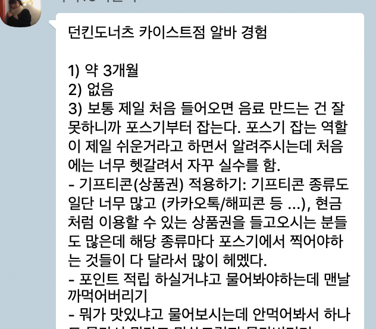

# [DP1] Needfinding Report

## Team Ogogada
Sangmin Lee, Yoonseo Kim, Sungha Eom, and Sihyun Yu

### Experience
We want to redesign experiences of training for new cafe part-time job workers.

### Observation & Interviews

We asked the following questions to the people who have an experience working at cafe. We tried to vary the duration, the number of worked cafes  for each interviewees.

> 1. How long did you work at the cafe?
> 2. Do you have any experience to teach someone with working at cafe?
> 3. Any experience to be embarassed while working at the cafe at the first time?
> 4. What was the method for you to learn how to work at the cafe?
> 5. Do you have any mistakes while working at the cafe? Why?
> 6. How did you do for the mistake? Any good way to prevent the similar mistake?

This is the summary of our interviewees. 

(sorted with the duration and the number of cafe, 1~5 are people who worked at only one cafe, 6~9 worked at more than 1 cafe).

> 1. Vanilla Latte - Worked at Tous Les Jours (less than 1 month) (Extreme User) - By Sihyun yu
> 2. Chamomile - Worked at Cafe (2 months) - By Sangmin Lee
> 3. Americano - Worked at Dunkin Donuts (3 months) - By Sihyun Yu
> 4. Earl Grey- Worked at Dunkin Donuts (8 months) - By Sangmin Lee
> 5. Cold Brew - Worked at Tous Les Jours (6 months), Lotteria (3 months) - By Yoonseo Kim
> 6. Espresso - Worked at Tous Les Jours (5 months), Ogada (7 months) - By Sungha Eom
> 7. Ice Tea - Worked at Angel-in-us (4 months), Ogada (9 months) - By Sungha Eom
> 8. Grapefruit Tea - Worked at 2 Cafes (14 months) - By Sihyun Yu
> 9. 1837 Black Tea - Worked at 2 cafes (16 months, 1 month respectively) - By Yoonseo Kim

#### 1. Vanilla Latte - Worked at Tous Les Jours (less than 1 month)  (Extreme User) - By Sihyun Yu

* Used Facetalk for interview
* Very new part-time job worker
* Had trouble to memorize so many types of breads and beverages 
* Hard to get used of the position of drinks at POS 
* Always think POS is too complicated to easily use
* Too many people at the same time make she so embarassed and lead some mistakes: did not check the expire date of coupon, ot Americano to ice Americano, entered wrong menu at POS...

#### 2. Chamomile - Worked at Cafe (2 months) - By Sangmin Lee

* Used Kakaotalk for interview
* Too many menus at POS machines make him hard to find some menu
* The discount rate is different for each card, but he didn't know that. So the guests were informed to him.
* Place recipe nearby, but it takes a long time to make menu with it
* Gap between education and experience

#### 3. Americano - Worked at Dunkin Donuts (3 months) - By Sihyun Yu

* Used Kakaotalk for interview
* Work with the POS at the first time, since not familiar with making drinks
* POS was so complicated and confused at the first time
* Often forget some questions to ask such as point collection
* Cannot ask at question of customers like menu recommodations, since she don't know either
* Too many orders at the same time makes her to forget some lists, or forget to putting something while making the drink
* Feel difference between real experience and verval/text guides

#### 4. Earl Grey- Worked at Dunkin Donuts (8 months) - By Sangmin Lee

* Used Kakaotalk for interview
* Have problem with using gifticon
* Find materials for drinks make her difficult
* Hard to handle detailed order such as using tumbler or KAIST discount
* Too many customers make her embarrassed

#### 5. Cold Brew - Worked at Tous Les Jours (6 months), Lotteria (3 months) - By Yoonseo Kim

* Face to face interview 
* Take a long time making many menus at once because she don’t know efficient sequence of making various menus at once
* Difficult to cancel and re-order all the orders after POS mistakes
* Want to have an encyclopedia of all situations while working in the cafe
* Have Watched 10~20 minutes of video and took the written test when she starts working
* Memorize all the names of breads when she starts working, but it’s confusing
* Have to buy it if she make a wrong menu 
  * Feel it's cold-hearted, but she understand it because many part-time workers make lots of mistakes 

#### 6. Espresso - Worked at Tous Les Jours (5 months), Ogada (7 months) - By Sungha Eom
* Face to face interview
* When working in Tous-Les-Jours, he had to ask for saving up points. He felt anxious when foreign students replied with question “What is CJ point?”.
* When he was new and orders were full, he was asked to get some ingredients from refrigerator. But the location changed without any notifications, so he felt anxious.
* When working in Tous-Les-Jours, he had to memorize all bread by looking up homepage.
  
#### 7. Ice Tea - Worked at Angel-in-us (4 months), Ogada (9 months) - By Sungha Eom
* Face to face interview
* The education policy was well not documented.
* Was confused when co-worker is making with changed recipes. Because the notification for changes are not clarified officially.
* At first day, managers tell where ingredients are located at, but it’s no use since remembering starts with actually making and finding them.
* The written recipes are not clear enough. So for instance, which ones go into blender and which ones are for toppings, etc.

#### 8. Grapefruit Tea - Worked at 2 Cafes (14 months) - By Sihyun Yu

* Due to the distance limitation, used Facebook messanger for interview
* Feel difference between paper recipe and doing the recipe in real
* Has experience mismatching the menu because of recipe confusion
* Recipe mistake disappeared as doing the part-time job for a long time
* Learned most things from the cafe manager 

#### 9. 1837 Black Tea - Worked at 2 cafes (16 months, 1 month respectively) - By Yoonseo Kim

* Due to the distacne limitation, used Facetalk for interview
* Uncomfortable with the explaination only in oral not by paper instructions
* Difficult and embarrassing to cancel everything and reorder when customer wants to change one menu
* Many implicit and omitted instructions make it hard to learn
* First day, working with a person who worked before
  * Too short for people who starts cafe part-time first time
* Easy to starting work in second cafe, but it seems to be too difficult for the people who starts cafe part-time first time
* Have printed the instructions to a new part-time worker

#### Interesting Moments

Based on interviews and observation, we found some interesting moments about our problem.

* POS uncomfortable for payment & revision

>> 
>> There are so many buttons in POS UI
>> 
>> Therefore, it is hard to know the meaning of each button
>> 
>> 
>> Usually, workers need to add additional post-it to justify these 

* Buy when they made wrong menus
* Be tested for studying menus with homepage or videos

>> 
>> New workers need to memorize all of information in the webpage
>> 
>> Sometimes, it is still hard to distinguish menus since they have similar appearance in real 

* Managers watch workers through CCTVs
* Not only managers but also proficient part-time workers educate new part-time workers

### Needs
* Look up what to do if they do not know at a certain situation
* Practice POS even if no people are ordering the menu
* Do not miss the list of orders while making menus
* Match the correct menu for every customer
* Give a list of recommendations to users 
* Provide a priority of menus to be made
* Know how much cups can be made at once for each menu
* Check all of the questions while taking the order
* Memorize all of the recipes of the menus
* Do not want to be embarrassed while facing various types of people

### Insights 

* There are many non-specific instructions and even some parts are omitted.
* Each store has different education method.
* Remembering the location of the material on the first day is still confusing, even if they have previous experience at another cafe.
* The experienced people are better able to respond to sudden situations
* Learn POS first, when they start a part-time job.
* Unlike bakery, they can work without memorizing all the menus.
* It is not easy to practice every menu because of monetary problems and time problems.
* A variety of situations occurs.
* Depending on the type of job, it may be better to do the job with the written recipe or may be better to learn by doing.
* Beginners are embarrassed when a lot of menus are ordered at once.

### Studio Reflections

- There are many good comments about our presentation. First of all, many people noted that we tried to find and analyze the situation and information deeply, and tried to point out notable, important points among these. 

> We thought this is our team's strength and we will try to keep this strength for further design project milestones. 

- In contrast, there were also some comments about specifying the type of cafe. Since each cafe has different characteristics (like includes/not includes bakery), so someone points out that it will be better to specify this for later milestones. 

> We also agree with this. For real implementation and testing for further process, it will be so hard to generalize all the cafes in one semester. Based on the information we got, we are planning to specify the cafe for making lofi or midfi prototype. 

- There also was a question that whether the structure of POS UI is different for each cafe even if the cafe is the same franchise. 

> We haven't considered about this and considering and knowing this will be helpful to our design project. We will ask more various people from other regions to check this. 

- For minor comment, someone commented that some parts of our presentation were a little bit fast so that hard to follow. 

> We realized this, and will more try to present with listener's perspective. 
