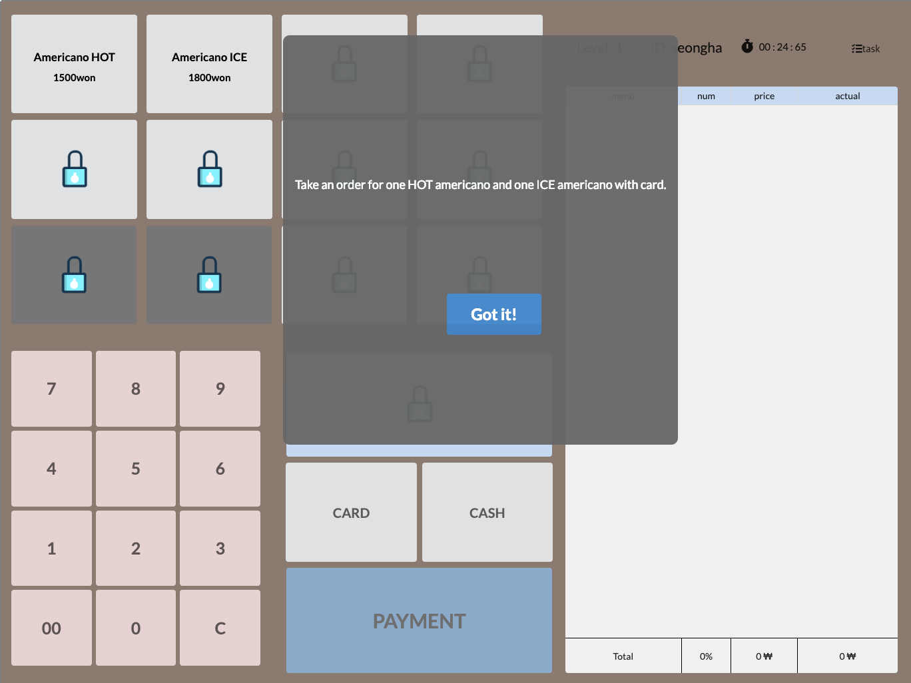

# [DP6] Hi-fi Prototyping

## Team Ogogada
Sangmin Lee, Yoonseo Kim, Sungha Eom, and Sihyun Yu

### POV
A new cafe part-time job worker 
needs to <strong> practice a lot and quickly get familiar with POS </strong> because <strong> most new workers are at the complex device POS, but there’s no explicit instructions or guides for that and he/she doesn’t want to be embarrassed at sudden situations. </strong>

### Target Users
New cafe part-time job workers
People who want to work at cafe as a part time job worker

### Tasks
1. Learn how to use Gifticon before playing game.
2. Get used to the location of important buttons.
3. Try to be faster than others to prevent being embarrassed when there are many customers or when you meet any demanding customers.

### Implementation Notes
- URL of the prototype:
https://blooming-dawn-12855.herokuapp.com
- URL of the Git repository:
https://github.com/sihyun-yu/Ogogada
Our project code is mostly in /ogogada-react directory.
- Libraries and frameworks: Nodejs, React, material-ui, Semantic-UI-React, Semantic-UI-CSS, firebase, lodash, unstated, etc
- Representative screenshots: 

This screen is SignIn screen. User can login with unqiue ID.

This screen is Home screen, which is main screen that connects to Rank screen and History screen.

This screen is History screen that makes users practice what to learn from each level.

 Since the current user is at level 3, level 4 and level 5 history is locked and cannot access. If the user levels up, then they are available.

This screen is of History of level 3. The red box tells users what to do step by step if he/she wants to success game of level 3.

This screen is for POS game level 1. Before starting the game, a dialog pops up to explain a task. There is timer that counts right after the user clicks "Got it!" button, and it ends until the user finishes the game. 

This screen is also for POS game level 1. The user did the task and now "PAYMENT" button is available to click. "PAYMENT" button is disabled until the player clicks all the necessary buttons. When he/she finishes, the button becomes clickable.

This screen is when the player finished POS game level1. A dialog pops up, telling that he/she leveled up from 1 to 2 and new button is introduced. At that point, the timer is stopped. When his/her record is in top 8 among all the users of the game in that level, the record is stored in DB.

This screen is of Ranking list from level 1 to level 5. Task is listed in text and the winner's ID for each level is shown.

This screen is for Ranking of level 3. Top 8 players' ID and their record is listed.

### Individual Reflections

- Yoonseo Kim
> I made some of the css layouts of this project. In log in page, I placed the logo and input in the center. In home page, I placed the logo and username and level which got from database. The user only can click the level button lower or equal with their level. On the POS page, I made and placed menu buttons, numpads, coupon, card, cash, payment buttons and summary table on the right part. Also except timer and task button, I placed the description on the top right div. Also I did some link between POS page to home when the game ended. In the ranking page, ranking according to the level is called from the firebase and placed in the background appropriately. 
> 
> I found that managing several and complex structured divs are really hard. I needed to first think carefully to decide how our divs structured. Also, it was difficult to implement the hi-fi prototype when the window size changes from user to user. I used 'flex' to deal with these problems. By setting ‘flex’ to property ‘display’ in div and set other parameter, I can easily locate other div inside one div in direction with row or column or locate contents in the center in one div. However, I could not do everything relatively in the layout. It was because it is doubtful whether it is correct to do percentages things such as font-size and margin. In fact, even on sites such as Google or Naver, the font-size remains the same for a while when the window size varies. These things were not clear to me and I had a lot of difficulty in make the hi-fi prototype. For this, I had to do more analysis with other complete website's UI changing their window size. Also since I was not expert in semantic-ui, I have hard time implementing the hi-fi prototype. More specifically, when implementing POS ui, I tried to change background color in semantic ui buttons, but it makes hover effect and click effect disappear. 
>  
> Finally, I had some difficulties using react js because I was not familiar with it. It took me a long time to understand how to pass data between the component, where to call db in component life cycle. I think I learned a lot while implementing hi-fi prototype and hope we will make better and more complete prototype before the user test. 

- Sungha Eom

> I contributed to most of the SignIn, Home, Rank, History page with Sangmin. I mostly contributed to designing the static screen of SignIn, Home, each Ranking pages, and implemented props functions for passing data like user information. I also helped Sihyun and Yoonseo implementing POS game little bit since that part contains many functions to be implemented. They did the main parts and I helped to check for user inputs whether they are correct and show popup dialogs, so on. These bullets are summary of what I’ve did mostly. 
> - Signin: SignIn screen and connecting to Home screen after signing in.
> - Home: Home screen,  linking buttons to each corresponding pos game using image mapper, ranking or pos history page
> - Pos Game: pop up dialog for giving questions, dialog for after finishing game,  functions to check user inputs with answer, store user’s record if the user’s record is within top 8 and then connecting to Home screen after finishing the game.
> - Ranking: designing the each level’s History screen
>
> I felt difficult when our teammates were fixing minor issues separately and communicate through messengers, because explanation tends to be not clear enough and I could not see the issue visually. But it was not a big issue because we worked mostly together. 
>
> I learned a lot while building an app from the start until deployment. Mostly I participated in fixing or building code for implementing functions, but I had new experiences like app deployment with Heroku + Git, and doing evenly contributing team project. One useful implement skill I learned is to quickly understand others’ code so that I could support them. I helped Sihyun and Yoonseo while they were implementing POS game with specific functions like checking user inputs, so on. I had to quickly learn their code structures and use their code. Through this experience I felt quickly understanding the already existing structures of code is necessary and important to be part of some big project in the future, like working as a developer. I wish I could actually find some bugs and contribute to improvements in code rather than just reading and understanding it. Also I found it useful to use tag extensions to quickly learn the implementation structure.

- Sihyun Yu

> I contributed to most of the POS UI page with Yoonseo. Specifically, I contributed to Gifticon page after clicking, enabled lock/unlock for each button, history following by red border with given order at each level, entering the code with Gifticon popup and so on. The Gifticon popup UI is used as the default popup page for our whole prototype. In addition, I contributed to implementing a most functional part of POS (like switching the menu list if we click prev triangle or next triangle) but since the reflection required to focus on ‘UI part’, I will not explain this in detail. 
>
> Since I already took CS473, Intro to Social Computing last semester so I’m quite familiar with web programming, especially for React.js. Therefore, I didn’t feel a lot of difficulties while implementing many functions and UIs. A small difficulty was about POS function: since I had no experience with working at the cafe, so I needed to ask what buttons and functions should be implemented very frequently to cafe part-time job workers. Plus, in the previous semester when I took CS473, we used only pure .css file (which was very challenging) but in this semester our TA suggested us to use react-semantic-ui. At the first time, this was challenging since I haven’t used it before and I’m only get used of pure css. However, after getting familiar with react-semantic-ui, it became much easier to layout and add some fancy UI features that I wanted to add. For coloring layout, since I have used material-ui design, I already know what color and transparency feel users to UI beautiful. (Like the background color of gift icon popup).  
>
> There was a small difficulty in communication. In the previous semester, I did almost part of front-end, and the other one teammate did most part of back-end. Therefore, there was no need to communicate with other teammates about front-end implementation such as: why and how did you implement like this? However, in this semester, all of us contributed to front-end all of us think a bit differently while implementation. Due to the complex structure of web programming, we consumed some time to understand each others’ implement structure since the overall structure of the web programming code is very complicated. (Like how others do manage props, state…) 
>
> In the previous semester, the management of ‘state’ among files was challenging since I was not familiar with React.js. In this semester, I managed most states in javascript files in Stores folder so that efficiently manage some states that I need to synchronize. Therefore, there’s no conflict in managing state and this is the thing that I thought useful In this semester. Plus, I also used the error handling method that we used on last semester using Kakaotalk. Using these methods, we can efficiently solve some errors after brief implement.

- Sangmin Lee

> I made History Page and Ranking page mainly. I made all of the components in the History select page and Ranking select page such as, history table, back button, etc. I also made description part of POS. 
>
> I have two big difficulties during this project. First is making UI of history page, and second is implementing timer. 
>
> Because this project is my first web programming using react, I was confused everytime I try to add components in our project. At first, I didn't understand any concepts of components of react, and I don't know how to add some functions at table with semantic-ui-react. However, after I become familier with react, I can add some properties(such as, clickable, invert, etc.) and make it better than hard coded html table easily.
>
> Implementing timer was also a big problem to me. I can easily find timer source code, but it is hard to make it run automatically after POS page rendered, and stop automatically when user press "Submit" button at payment dialog. Since this is my first web programming with react, I don't know anything about 'componentDidMount'. After I spent some time for search the solution of this problem at google, I learn the life cycle of react component and can make timer start automatically. Make timer stop automatically is more difficult than make timer start. In our program, paymentDialog component and timer component are quite apart. Therefore to make interaction between those, it needs to use 'props'. But I don't know any concepts of parent and child interaction, so I studied more than 3 hours to get solution of this problem. Without these problems, I also have some troubles with fixing bugs.
>
> Through DP5 and DP6, I learn lots of implementation skills of web programming. I learn how to use React, and semantic-ui-react. I also learn how to deal with props. Moreover I got some tips to place components with .css.
>
> I use git at Visual Studio Code without setting config name and email, so it doesn't show any commit history at our Github Contributer tab. Please refer to our commit log if you want to check.

### Studio Reflections

There were some comments after the presentation. Because this milestone is related to implementation, most feedbacks are about our UI.

First, there were some feedbacks about the relation of our implementation and tasks. Someone said that it is hard to notice that how does second task is related to our implementation. Another person also mentioned that our second task is not appropriate to our POS model.

> 	We agree with this feedbacks. It is not easy to memorize all buttons by just following our level system. Therefore, we slightly change our second task not to remember all buttons, but remember important buttons.

Also, there are some comments about function of our prototpye. Someone said, "It is better to show the ranking and time after user finish the level with good performance"
The only way to know the record in our implementation is going to ranking page. 

> We haven't consider about this. This is very great idea to encourge users. We will going to apply this function to our works and this might be help our work look more attractive to user.

Someone gives us feedback that it might be better to make the image of clickable material looks like a button or something.

> We agree with this comment. In this milestone, we focused on creating prototype to meet user needs. Therefore we was a bit neglected in functions that is not strongly related to user needs. After works, we will make level select image looks like button.

Someone notes that the font size of prototype is too small.

> We realize ths problem, and make font size bigger than before.