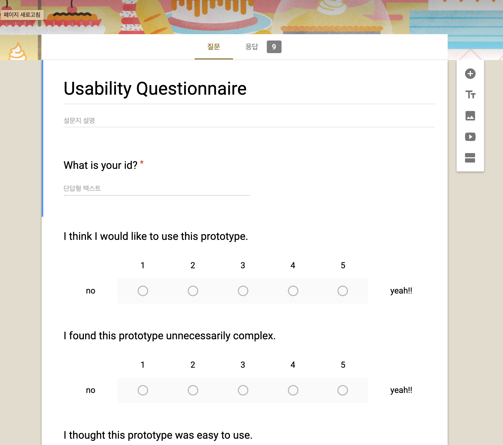
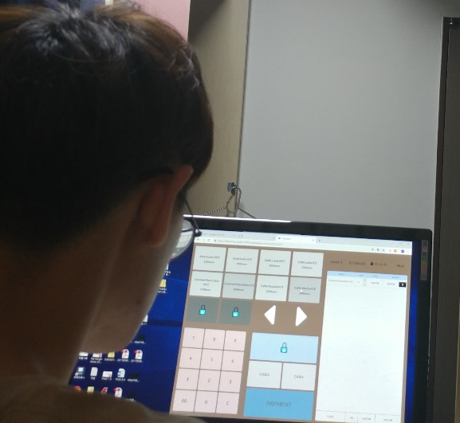
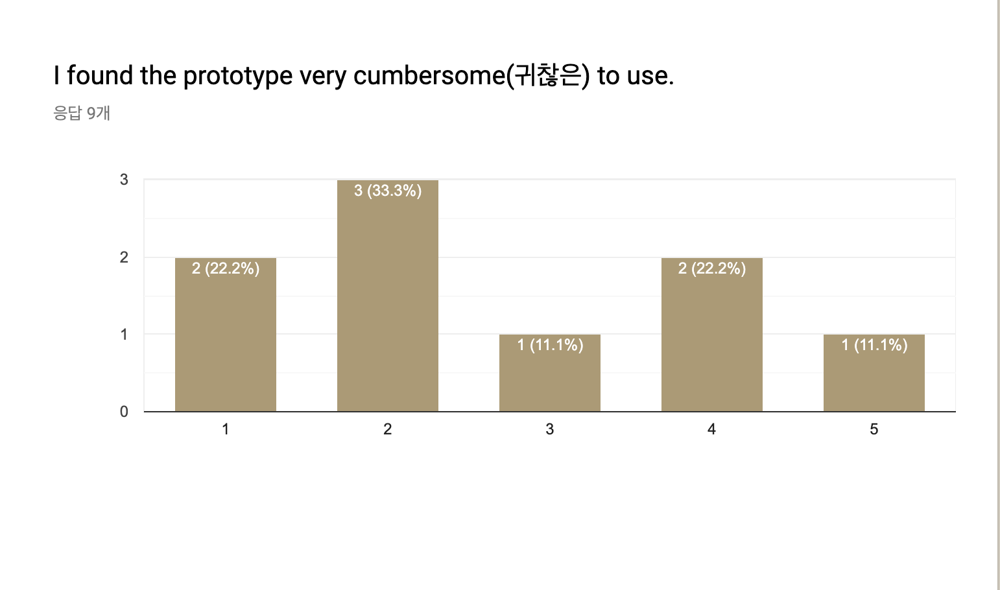
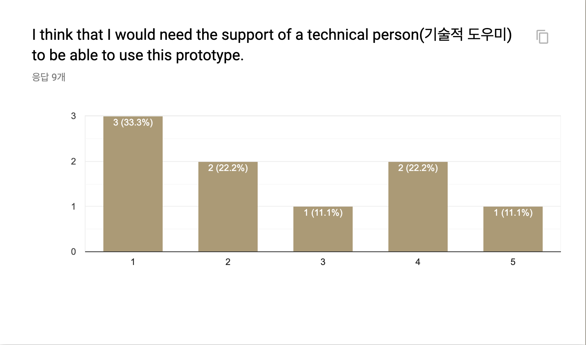
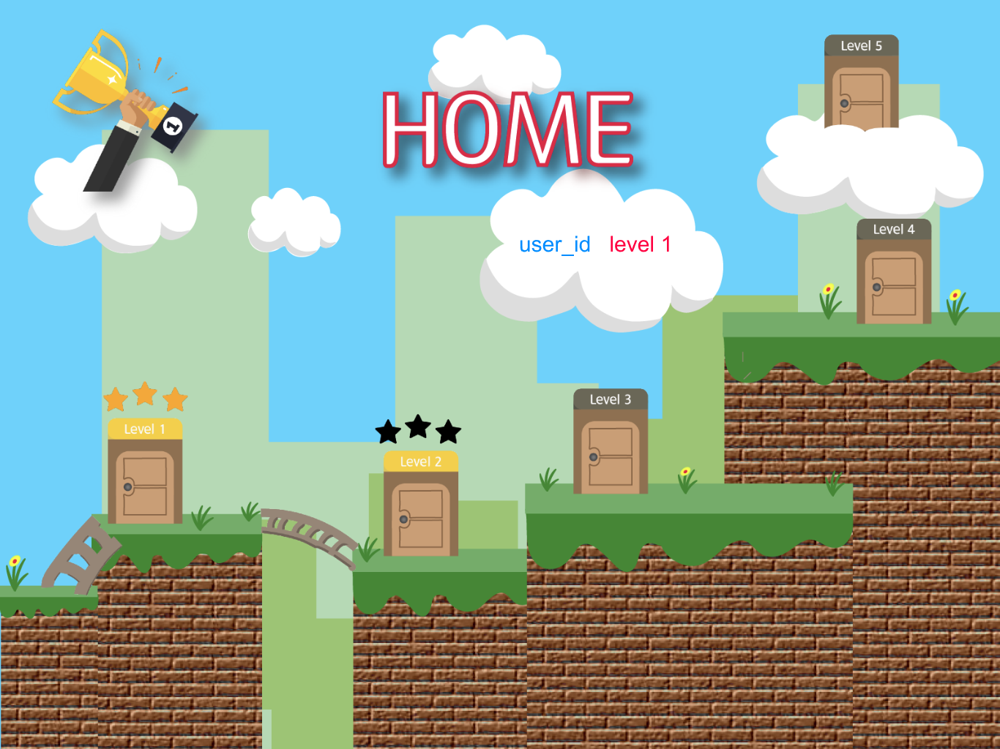
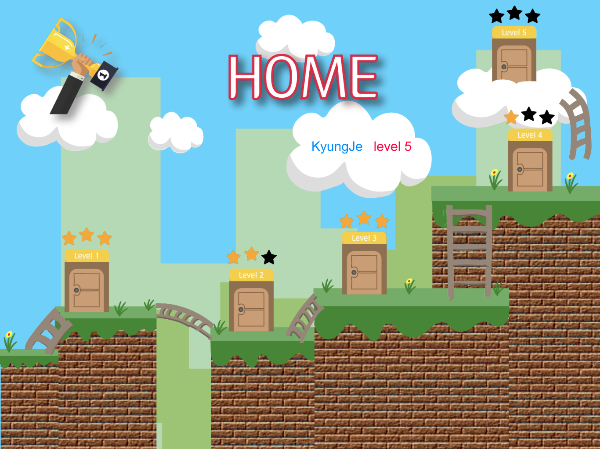

# [DP7] User Testing

## Team Ogogada
Sangmin Lee, Yoonseo Kim, Sungha Eom, and Sihyun Yu

### Written protocol

#### Instructions for preparation and setting up the testing environment

> Go to URL, https://blooming-dawn-12855.herokuapp.com.
> Please use Chrome with size 1200 x 900.
> Please do not use back button of Chrome browser.

#### Introduction and informed consent

> Hi. We are team Ogogada.
>
> From now on you will experience our prototype. Our prototype aims to help user learn how to use POS machines for those who are new at cafe part-time job. For our purpose, our prototype will help you be familiar with some important buttons, learn how to use important functions, such as gifticon or refunds, and able to see your progress by timer.
>
> Whil you are experiencing our prototype, we will take some pictures. Also, your play history will remain in our DB. If you agree, please proceed to the next.

#### Tutorial or training (if needed)
> Since our tasks don't require any prior familiarity with our prototype, we did not provide them any tutorial or training.

#### Task list & instruction
> Task 1. Get used to the location of important and frequently used buttons, such as "ICE Americano button".
>
> Task 2. Watch and know how to use Gifticon.
>
> Task 3.  <strong> Try to be faster </strong> than others to prevent being embarrassed when there are many customers or when you meet any demanding customers.
>
> We provide the end-to-end scenario of test user who wants to get familiar with POS and learn how to use Gifticon. The three tasks are mentioned in parenthesis.
>
> 1. Signin with your own ID (we will make ID for each participant)and password "1111". You are currently at HOME page and your are level 1.
> 2. Go to HISTORY page and get familiar with locations of basic buttons by clicking hisotry of level 1. (Task 1)
> 3. After clicking history of level 1, you are at HISTORY POS page. Follow the guidance with buttons with red highlight. (Task 1)
> 4. After finishing it, the screen automatically goes to HISTORY page. Go to HOME page in order to play the game of each level.
> 5. At HOME page, press level 1 and start playing the game of level 1. (Task 1)
> 6. After clicking level 1 button, you are at GAME POS page. Read the instruction and press "Got it!" button to begin. If you want to re-read the task, press task icon on right top corner. Be aware that there's timer running already before pressing "Got it!" button. Also, you can press "Payment" button when you done given task correctly except clicking "Payment" button.
> 7. After finish, press "Submit" button and you can know that you leveled up and what buttons are unlocked. Press "Got it!" button.
> 8. After finishing it, the screen automatically goes to LEVEL 1 RANK page. You can check your rank if your record is under 8th. (Task 3)
> 9. Go to HOME page by clicking "Back" button two times. Repeat step 2 to 8 until your level is 4.
> 10. Go to HISTORY page and select level 4. Follow the guidance with red highlights. (Task 2)
> 11. You have done all the tasks and enjoy the game if you want to learn more!

#### Recording strategy

> We are going to take photo while you experiencing our prototpye, and if you do well with some tasks, your record will be remained in our DB.
> During user testing, one person did the role of tech person, and another person did the role of facilitator and other two persons did the role of observers. We switched the role for each participant in user testing.

#### Questionnaires, Interview questions

> After we observed test users, we asked questions about some things we have expected the users might be struggling with, such as
>> <strong> "Did you feel this UI is complex or difficult?"
>> "Did you feel difficulty when applying Gifticon?
 and how about now?" </strong>
>
> and some additional questions based on their behaviors. 
>
>  Also we asked them to fill out 5 point likert scale questionnaire from "The SUS Survey" (source link is below) in Google form (form link is below). 
>
>
>
> "The SUS Survey" source: https://arl.human.cornell.edu/linked%20docs/Choosing%20the%20Right%20Usability%20Questionnaire.pdf
> Our survey link: https://docs.google.com/forms/d/1ve4cWWTc9wXS6iZ_r9yF1ePLlfEpiy8VQDtHMkwYVr0/edit#responses

#### Debrief prompt

Thank you for testing our prototype. Our project is for effcient POS learning for new part-time job workers at the cafe. Since many new workers at the cafe are often embarassed at many new situations, so we tried to solve this problem using our prototype by learning POS fun and efficiently. Again, thank you so much! 

### Session observations

#### Participants

- Total 9 participants for testing
- 6 people are completely new at using POS, 3 people has experience using POS
- Tried to find participants that matched our persona(Early 20s, less part-time work experience).

1. gogi
    - 22 years old, Male
    - Totally new at using POS
    - Use computer for test

2. james
    - 21 years old, Male
    - Totally new at using POS
    - Use computer for test

3. seol
    - 23 years old, Female
    - Totally new at using POS
    - Use iPad for test

4. guunn.juu
    - 22 years old, Male
    - Has POS experience (Less than a year)
    - Use computer for test

5. gamgam
    - 21 years old, Male
    - Totally new at using POS
    - Use computer for test

6. bjw
    - 22 years old, Male
    - Totally new at using POS
    - Use computer for test

7. hojiny103
    - 22 years old, Female
    - Has POS experience (Less than a year)
    - Use computer for test

8. nanah1929
    - 21 years old, Female
    - Has POS experience (Less than a year)
    - Use computer for test

9. hancy5
    - 21 years old, Male
    - Totally new at using POS
    - Use computer for test

### Usability lessons
We devided the oberservations by three themes, visiblity, affordability and gamification. And we classified them into high, medium, and low based on the correlation with tasks.

- Visibility: Can users find what they have to do easily without additional verbal or textual explanations?

- Affordability: Can users interact with our prototype with enough reactions in both ways?

- Gamification: Do users feel like an actual game? Do users play and expect like any other games?

<strong>Visibility </strong>

High

> In HISTORY POS page at level 4, when applying Gifticon, the user had hard time finding highlighted num pad button with red border.  The user tried to click white form in “Insert Gitficon Code” dialogue (seol, gogi, jungu)
>
>- We will make the num pad more visible as the pop up dialog.
>
> In GAME POS page, the user did not understand the task properly and kept checking the task agin and again. (james)
>
>- We add a voice to make the user concentrate on remembering tasks.
>

Medium

> In HISTORY POS page at level 3, the user did not know how much the student discount was. (james, gamgam)
>
>- The description of level 3 in HISTORY page should include “10% student discount”
>

Low

> In GAME POS page, the user confused ICE and HOT. (gogi, seol)
>- If would be better if ICE and HOT are separated by color such as blue and red
>

<strong> Affordability </strong>

High

> In GAME POS page, the user cannot remember task quickly and cannot find Task button well to look again. (jungu, gamgam, hancy5, gogi, james)
> 
> - Make the button more visible and attractable.
>

Medium

> In HISTORY POS page, since there was no description after entering page, it seemed that the user just follow red box without understanding what he or she is doing. (gogi, james, gamgam)
> 
>- Description of tasks needs to be added.
>
> In GAME POS page, the user confused about how to change number of menu in summary table. Actually we have three ways of changing number of menu (james, seol)
>
>- It would be better if we highlight menu in the summary table if the user click it to change number of order. Or it would be better if we remove ‘+’ and ‘-‘ buttons in each menu in summary table.
> 

Low

> Trying to use back button in chrome browser (gogi, gamgam, bjw, hancy5) 
>
>- This is not an important issue since the final version would be on Ipad

<strong> Gamification </strong>

High

> Even experiencing HISTORY POS page, the user did not try to entry HISTORY page before playing actual GAME. (james, jungu, gamgam)
>
>- The word “HISTORY” did not correspond with current functions. Delete “history” button in HOME page and add new “tutorial” button below each level “game” button.
>
> In HOME page, the user thought that three stars beside each level’s button mean something. (gamgam, bjw, hancy5, jungu)
>- Based on the finishing record of time, rate the stars so that users can feel accomplishment.

Medium

> Some user irritated when they move to LEVEL {level} RANK page automatically after finishing game in GAME POS page. (gamgam, bjw, hancy5)
> 
>- Give options to move such as HOME page, RANK page.

#### High-level reflections

Getting quantitative answers from questionnaires helped us a lot knowing users' feeling of our prototype. These are some surprising answers we got from user questionnaires. Most of users gave us positive answer in most questions.

 However, we noticed that some users thought that our prototpye is unnecessarily complex and some users were cumbersome to use the prototype. Also, some of users thought they need the support of technical person to be able to use the prototype. For the better UI, we need to keep in mind that users don’t act as we expect in various ways. For example, some users have hard time finding number pad which is highlighted with red boarder in HISTORY POS page. It was a problem that we never thought of. Thus, we need to think more in user side and make the UI as easy and simple as possible. 

### Studio Reflections

There are some meaningful feedbacks after our studio. We summarzied these feedbacks and have thought about theses.

I like that you tried to match your participants to the chosen persona. 
> Since we set and fixed our Persona very beginning of our milestones, we also considered who should test our prototype very early. That's why we can have the test with people who have similar properties of Persona we set. 

Showing graphs helped me understanding and for visualization.
> We thought that it is usually hard to show statistical results in HCI result, since many questions may feel test users to surjective. To overcome this, we tried to think a lot about survey questions a lot which is quite objective than others (also looked some existing questions that used in HCI research). Furthermore, to show objective and quantitative result, we are planning to compare the time to complete the certain order before learning and after learning. Plus, since statistical result is meaningful if there are enough number of test users, we are planning to test more with different people that fit to our persona. 

I wish the collected data was not that limited. Few questions with 1 to 5 scale answers significantly limit the amount of possible feedback that could have been collected
> As said at above, it is true that quantifying the result with objective questions in HCI field is quite hard. Therefore, not only doing survey questions by 1 to 5 scale, we also did interview with test users. Later, to verify our prototype, we are trying to mearure and compare the time difference with people who used our prototype and not used our prototype, to argue our protytype helps to solve POV that we set. 

I like that many potential users tested your project. However, is there any extreme users like someone who are not familiar with digital devices?
> We haven't thought about this, and it is true that there might be some people that who wants to work at the cafe but not familiar with digital devices. If we can find such people who also fits to our persona, we will ask those people to do the test.

### Plan for iteration

After getting feedbacks from users and people at the studio, we made a plan to make our prototype better. Since we have not enough time (which is about 1 week), we considered a lot how can we efficiently solve as many problems as we can. Theerefore, we thought a lot about simple ways to apply most feedbacks from users and people at the studio.

First of all, there was a feedback from two test users, "In GAME POS page, often confuse ICE and HOT." Therefore, we will try distinguish these by color (red with HOT, blue with COLD)

Plus, there were some feedbacks that task information is hard to catch at once and some information were missing in both modes in our prototype. Therefore, we try to fix this by checking the task information one more time (such as student discount is 10%), keep showing the task in showing history mode. 

Furthermore, there were some feedbacks tht UI design at the home page looks bad and hard to catch the meaning of each buttons. Therefore, we are trying to change the home page UI design like as below, so that users can catch the meaning of each button easier, leads to convienient use of our prototype.

Finally, focusing on usability lessons with "HIGH" that we clasified, people first mentioned that it was hard to find and recognize the numpad buttons when they need to use buttons when using gifticon. Therefore, when this situation, we will also make the highlighted border at whole numpad so that users can recognize the existence of numpad well. 

Plus, many people said it is hard for users to remember the task at once while playing the game, and it was 'hard to find the task button for seeing again the task'. (which is shaped with bell shape on the right above).

Lastly, many people get confused of the purpose of "history mode". Our purpose is history mode is like a tutorial mode of each game level mode, but they often misunderstood the purpose. Therefore, we changed the concept and design of Home Page UI on the below, After finishing each level, ladder between two levels appears, which is tutorial mode (was history mode in our original prototype) for the next level task.

