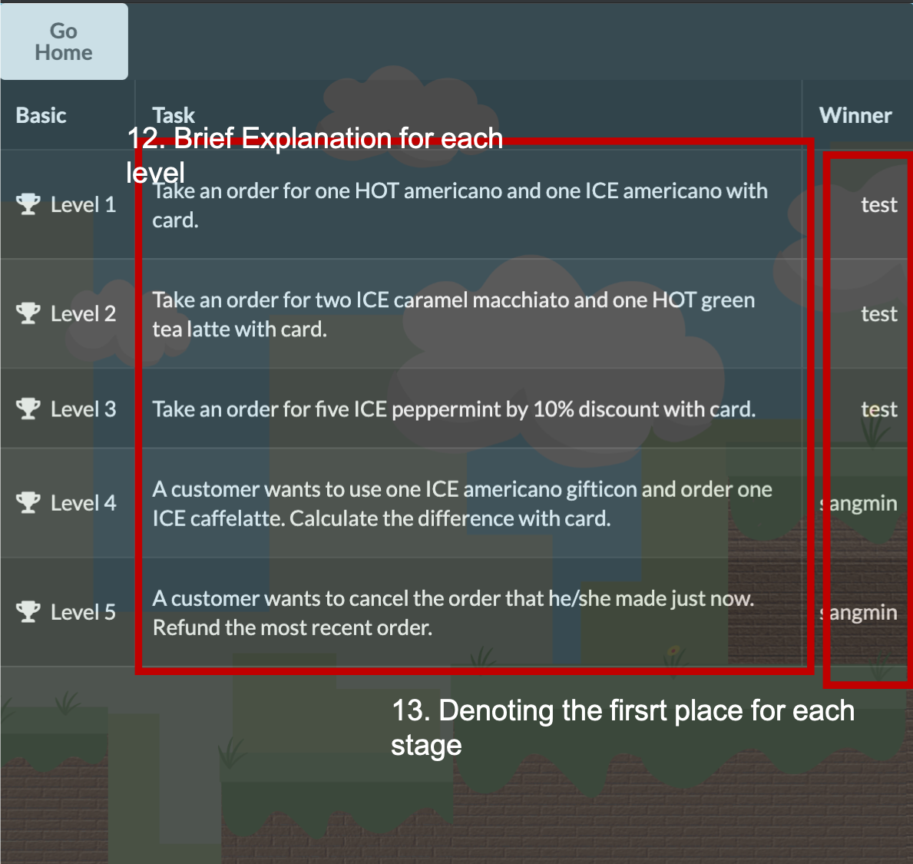

# [DP7] User Testing

## Team Ogogada
Sangmin Lee, Yoonseo Kim, Sungha Eom, and Sihyun Yu

### Final Interface
#### Representative screenshots 
##### 1. Our Main Home Page

You can check there are buttons for accessing to ranking page, game page, and tutorial pages.
##### 2. Game Page (in this screenshot, for level 1) 

Some buttons are differentiated by color (HOT for red letters, ICE for blue letters) and timer, level status are denoted. Buttons for rechecking the task and go back button also exist. Users will do the task with the POS UI that several buttons are locked with their level. 

After completing the task, user can choose to see the ranking or to go to home page. 
##### 3. Tutorial Page (in this screenshot, for level 2)

Still, buttons are locked/unlocked and differentiated by color (such as HOT/ICE). The dialog before starting the tutorial says to follow the buttons with the red border, so that users can understand what to do. The 'red' letters of the instruction has 'red' color so that users can easily recognize by emphasis.

As explained, users can follow the instruction by clicking the buttons with red border.

If users want to go back to the home page, we reask user 'Are you sure?' to avoid accidental returning back. 

After accessing the ranking list page, users can know what they were supposed to do at the certain level and immediately check the winner of certain level. 

By clicking the element of the list, users can know all 8 top players for each level. 
#### Quality arguments 
Our key idea to solve the problem is using gamification so that users can learn the POS so fast and efficiently. By lots of user testing during the semester and a lot of consideration among our team, we now can say our interface is great for a few reasons and successfully achieved our goals. For a better explanation, we will use figures uploaded on the above.

Since we wanted the process of learning POS looks very familiar to users, we tried to design and implement our homepage very similar to existing game home pages. There is an intuitive ranking button with the hand and arm holding a trophy. Plus, there 5 stages of game buttons and tutorial buttons, represented by door icons and ladder icons, respectively. While showing a demo to our classmates, many people said our home page looks friendly so that learning POS using our UI doesn't feel so hard for the first time. Especially, for parts of tutorial and game mode buttons, we focused on Affordance. As user level increases, ladder (denoting tutorial mode for each level) appears for users next level to lead to click the ladder button before doing the game mode of an increased level. Rather than separating all of the tutorial modes on independent one button, this increased users' affordance. Plus, an overall interface that users face also make them all processes doing tutorial then game look all connected. Lastly, game mode buttons that the user can access are differentiated by color which is easily recognizable. 

Now, let's focus on pages for our main solutions. First, focusing on the game mode page. There are POS UI which is familiar with us. There are some convincing arguments on this page. We first differentiated some buttons by color (HOT for red and ICE for blue) so that users can easily memorize and access to the button, and eliminating the confusion among these buttons. This is NOT the feature that original POS UI have, so we expect users to learn the POS easier with our interface rather than practicing the POS using the original POS interface. Plus, there are some locked buttons. These buttons enable users to focus on frequently used few buttons at the first time so that they can memorize and get familiar with these at the very beginning of the process, and make users want to open rest of locked buttons, so users feel the process of learning with more fun. Lastly, users can recheck the task and continuously check their time while finishing the task at a certain level, so users can feel learning POS just like a game.

Now, focusing on the tutorial page, we bordered a button with red color with the order of instruction so that users can easily follow the instruction. So, compared to using original POS UI to learn, users can easily follow what to do in a given situation. There are some comments that description for this (follow the red border) is insufficient, so we added a dialog before starting each tutorial and the part that users should click the button with red buttons is emphasized with red letters. Therefore, the user can recognize what to do on this page within very short time periods.

For minor usability issues, which are not related to our solution still important for our interface, we first added BACK button on both tutorial mode and game mode so that users can return back to the home page if they don't want to do the process. To avoid accidental returning, we ask "Are you sure?" after clicking back button. (Denoted as 11 as above figures) Plus, we found that there are two types of users after the game mode via user testing: who want to check their ranking or want to finish next levels quickly. To satisfy all of them, we made a popup after completing the task with selections to move to rank or home. (8 at the above) Finally, at the ranking page, to avoid users to return back to each level to check the task, we briefly explained what the task was at each level and the first place of each level (12, 13 at the above). (699 words)

### Iteration

During DP8 period we mainly focused on two things. First one is changing UI of home page. Our previous home page design was poor, and there were many people who did not know the existence of the history page, so we chaged the home page disign to solve these problems.

The above image is our previous homepage. With our previous design, it is hard to notice that user can have tutorial for each level before doing main game. We change our design to make people clear the main game after tutorial with ladder and door image. Also, after the stage was cleared, we make a new ladder connect to the next door to increase the user's sence of accomplishment.

Second one is bug fix and increasing usability for better end-to-end experience. Our prototype was inconvenient to use. User can proceed our prototype without any bugs if they follow our instructions. However, if user run it in a slightly different way, some bugs came out. Moreover, the tutorial page did not have a description of the task, so user could not figure out what the user was doing, and there was no way to get out of the game and tutorial pages if user wanted to quit. There are also some minor problems such as, hard to distinguish between ice and hot. We fixed these problems so that our prototype worked under any situations, and we also improved visibility, affordability, to makee our prototype easier for users to use without any instructions.

During the iteration, we found that it was very difficult for users to be aware of our intentions, and to make user knowtice our intention it needs to be much more intuitive and easier to do than we think.

### Individual reflection
#### Sangmin Lee
#### Yoonseo Kim
#### Seongha Eom
#### Sihyun Yu
For me, I have taken a very similar course in the last semester: CS473, Intro to Social Computing. Therefore, I was quite confident about the design project process since most milestones are similar to the thing that I’ve done before. Not only my experience in the design process, but other teammates also worked very hard and consumed a lot of time during the semester. For these reasons, I think we got the right direction about what to do faster than others, by doing a lot of interviews and try to set 3 solutions for our selected problem. As a result, we finally got ‘Most Human-Centered Awards’ at the last class, and we got perfect scores at the first few DP milestones. ‘Rather than focusing on making perfect service, try to find and implement 3 solutions to solve our problem’ is the thing that we worked well I think. 

The thing that we didn’t work well is implementation. I thought I can finish implementing our UI very fast since our UI required a few things to do compared to the service that I implemented on CS473. Plus, two of us (I and Seongha) had an experience on web programming, we thought everything would go well. However, there were some unexpected problems while implementing the UI. As a result, honestly, our prototype had bad usability and had some errors until the deadline of the hi-fi prototype. Furthermore, I was taking Operating System course and Advance ML course at the same time in this semester (one of the time-consuming courses), so it was really hard to consume a lot of time on design project after the midterm compares to the previous semester CS473. Not only me, but others also have a different plan and some of them are busy to prepare their graduation. So it was hard to meet and implement UI together on the offline after the midterm. To solve this implementation problem, we derived 2 solutions. First of all, we often summarized some errors and issues that we need to solve and determined who will solve such issues on KakaoTalk group chat room, just I had done in CS473 design projects. For lack of usability on hi-fi prototype issue, we got a lot of feedback from TAs, and test users, then we consumed a lot of time to apply those feedbacks from the problem. Finally, we finally got the UI with high, nice usability on final class demo sessions. 

Since it was the second time for doing this design process and web programming, I learned a lot by comparison with the initial project that I've done in the previous semester. The first thing that I learn is, there's no perfect solution that can be applied to all user-centered design. For instance, we tried to make the different QnA platform in the previous semester, and most users are considering only 'Asking' and 'Answering' at the questions, the design should be simple and only a few buttons SHOULD be required. However, this semester, since we were trying to make the platform that users can learn the POS efficiently, too much simplification or abstraction had some side-effects since in the learning process different users have different viewpoints and understanding while learning. Therefore, we needed to think 'How to give information efficiently to users' rather than 'Simplification on UI'. Even the broad topic of my two design projects are related to 'Education' (QnA or Learning platform) the focusing point and solutions that I needed to think to have a lot of difference. So I learned it is important to see and analyze the given problem very deeply with lots of studies to make a real user-centered UI. Plus, I'm happy to learn and know some useful libraries such as React-semantic-UI for better .css format handling, since in previous semester there's no guide about this so we only used pure .css format for design. I think is the biggest and useful thing that I learned for web-based GUI implementation throughout this course this semester. Very thankful for TAs, professors and my teammates to have such nice experience during the whole semester!